# 算法与数据结构——王金宝

数据结构：存储和组织数据，便于访问和修改；使用过一些算法，但更加侧重数据结构本身的应用，并非针对算法本身

算法：是一种重要的技术，技术自成体系，在效率方面的影响巨大

[TOC]

## 1. 绪论

知道几个人：；**Edsger W. Dijkstra**；**Donald Ervin Knuth**（《The Art of Computer Programming》）；**Stephen Arthur Cook**；**Richard M. Karp**；**Niklaus Wirth**；**John Hopcroft**；**Robert E. Tarjan** ... ...

### 1.1 解决一个计算问题的过程：

> 可计算否：可计算理论 
>
> 能行可计算否：计算复杂性理论
>
> 设计与分析算法：算法设计与分析
>
> 用计算机语言设计实现算法：数据结构与程序设计
>
> 软件系统：编译，操作系统...

#### 1.1.1 可计算理论

> 1. **计算模型**
>
> ​	Turing机、递归函数、lambda演算、正则算法、POST系统
>
> 2. 可计算问题/不可计算问题
>
> 3. **计算模型的等价性--图灵/Church命题**
>
> ​	所有合理的计算模型，其计算能力是等价的


#### 1.1.2 计算复杂性理论

> – **在给定的计算模型下研究问题的复杂性**
>
> • 固有复杂性
>
> • 复杂性上、下界
>
> • 平均复杂性
>
> • 复杂性问题的分类: P=NP?

#### 1.1.3 算法设计和分析

> – 解决可计算问题的算法的设计与分析
>
> – 设计算法的理论、方法和技术
>
> – 分析算法的理论、方法和技术

#### 1.1.4 计算机软件

> – 系统软件
>
> – 工具软件
>
> – 应用软件

### 1.2 算法的概念

——算法的定义、问题的定义、算法的示例

**定义1 (计算)** 可由一个**给定计算模型**机械地执行的规则或计算步骤序列称为该计算模型的一个计算.

> • 一个计算机程序是一个计算（计算模型是计算机）
>
> • 计算可能永远不停止——不是算法

**定义2(算法) **算法是一个满足下列条件的**计算**：**终止性**、**确定性**、**能行性**、**输入**、**输出**；

**定义**3(**问题**) 设𝐼𝑛𝑝𝑢𝑡和𝑂𝑢𝑡𝑝𝑢𝑡是两个集合. 一个问题是一个关系 𝑃 包含于 INPUT * OUTPUT，𝐼𝑛𝑝𝑢𝑡称为问题𝑃的输入集合，𝐼𝑛𝑝𝑢𝑡的每个元素称为𝑃的一个输入，𝑂𝑢𝑡𝑝𝑢𝑡称为问题𝑃的输出或结果集合，𝑂𝑢𝑡𝑝𝑢𝑡的每个元素称为𝑃的一个结果.

> • 问题定义了输入和输出的关系；是**二元组集合**

定义4(**问题实例**)问题*P* 的一个实例是*P* 中的一个二元组

### 1.3算法的分析

**定义**5 (**算法正确性**)一个算法是正确的，如果它对于每一个**输入都最终停止**,而且产生**正确的输出**；

正确性证明 | 复杂性分析：输入大小的函数；

**定义**6 (**输入的大小**) 设*Input*是问题*P*的**输入集合**，*P*的输入大小是一个函数$F$：*Input*→$N$，$N$是正整数集合;

**定义**7 (**实例时间复杂性**). 一个算法对特定输入的时间复杂性是该算法对该输入产生结果需要的**原子操作数**.

**定义**8 (**实例空间复杂性**). 一个算法对特定输入的空间复杂性是该算法对该输入产生结果所需要的**存储空间大小**

**定义**9 (**算法最坏复杂性**)设$Input$是问题*P*的输入集合，$Complexity(Size(x))$是求解$P$的实例$x$的算法$A$的复杂性函数，$A$的最坏复杂性是$Max\{Complexity(size(x))\mid x\in Input\}$

**定义**10 (**算法最好复杂性**) $Min\{Complexity(size(x))\mid x\in Input\}$

**定义**11 (**算法平均复杂性**) $\sum_{x\in Input}p_x\times\text{complexity}(\mathrm{size}(x))$

## 数学基础

### 2.1 计算复杂性函数的阶

### 2.2 和式的计算和估计

### 2.3 递归方程

## 分治算法

导学：原理 | 分治的排序 | 线性排序算法 | 中位数selection | 最邻近点对 | 凸包 | FFT | 整数乘法

### 3.1 divide_conquer原理

设计过程：

​	Divide: 整个问题划分为多个子问题：不要求全部是相同子问题；

​	Conquer: 求解子问题（正向递归调用）；

​	Combine: 合并子问题的解，形成原始子问题；

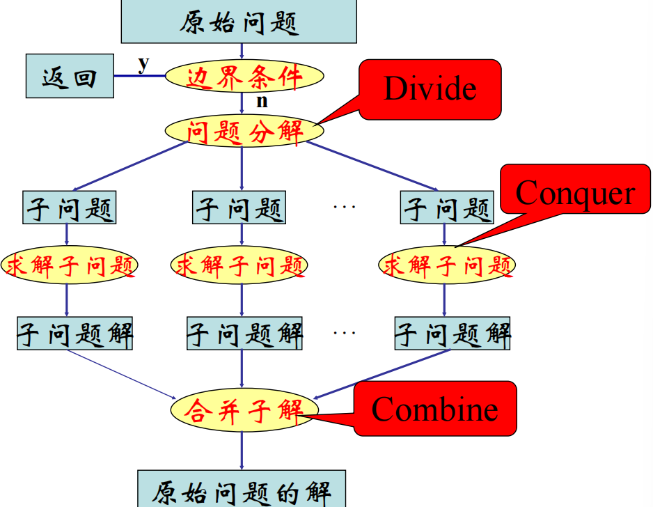  

分析过程：建立递归方程→求解 | 建立递归方程：输入大小为$n$,$T(n)$是时间复杂度，当$n<c,T(n)=\theta(1)$，即求解常数量级的输入时，便是常数时间复杂度；

​	Divide: 划分a个子问题，大小为$n/b$；划分时间为$D(n)$;

​	Conquer: 递归调用，求解时间为 $aT(n/b)$

​	Combine: 时间为$C(n)$

递归方程：$T(n)=\theta(1),if \quad n \le c; T(n)=aT(n/b)+D(n)+C(n), if \quad n > c;$

例子1：MaxMin(A) $O(3n/2-2)$

```
1. If j-i+1 =1 Then 输出A[i],A[i],算法结束
2. If j-i+1 =2 Then
3. 		If A[i]< A[j] Then 输出A[i],A[j]; else 输出A[j],A[i];
		算法结束
4. k←(j+i)/2
5. m1,M1 ←MaxMin(A[i:k]);
6. m2,M2 ←MaxMin(A[k+1:j]);
7. m ←min(m1,m2);
8. M ←max(M1,M2);
9. 输出m,M
```

### 3.2 基于分治的排序

划分策略：mergesort:中间点；quicksort：任选划分点x，利用x将数据划分成两部分；

合并策略：不同的合并方式；

**快排**：无序序列$[p,...,r]$,划分点是q

​	divide：将无序序列依据某一个选定的划分点q划分成大于划分点和小于划分点的两部分；

​	conquer：递归调用quicksort(p,q-1) quicksort(q,r)

​	combine: 不需额外操作：因为两侧无序子序列经递归调用结束已变成有序序列；

伪代码: $\theta(n)$

```
Partition(A,l,r)
 x = A[r];
 i = l-1;
 for j = l to r-1
 	do if A[j] < x
 		i+=1;
 		exchange A[i],A[j];
 exchange A[i + 1],A[r];
 return i+1; // 这是r的位置
```

主函数 $avgT(b) = O(nlogn), worstT(n)=O(n^2)$

```
Quicksort(A,l,r)
	if l < r
		m = Partition(A,l,r) // divide
		Quicksort(A,l,m-1) // conquer
		Quicksort(A,m+1,r) // conquer
```


关键：证明算法正确性的方法：**循环不变量**

​	证明算法主要结构是**循环结构**的算法的正确性

​	循环不变量是：数据或数据结构的关键性质，依赖于具体的算法和算法特点；

三个阶段：

1. 初始阶段：证明**循环开始之前**循环不变量成立；
2. 循环阶段：证明**循环体每执行一次**，循环不变量都成立；
3. 终止阶段：**算法结束后**，循环不变量保证算法正确；

循环不变量的定义：

```
at the start of the loop of lines 4-7, for any k // 索引数组中的每一个元素
1. if p ≤ k ≤ i, then A[k] ≤ x.
2. if i+1 ≤ k ≤ j–1, then A[k] > x.
3. if k=r, then A[k]=x
```

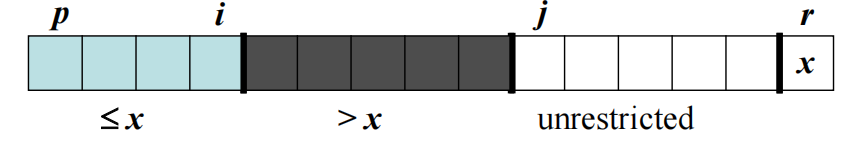

证明：

​	初始阶段：i = p - 1, j = p，区间为空，1,2正确；初始化要求x = A[r]，3正确；

​	循环阶段：假设j = k成立，证名：j=k+1时，成立；假如j=k+1,如果大于，则不用交换位置，不变量成立；假如小于，i=i+1,A[i]与A[j]交换，不变量成立；

​	终止阶段：算法产生三个集合：$\{ a \le x\},\{a > x\},\{x\}$

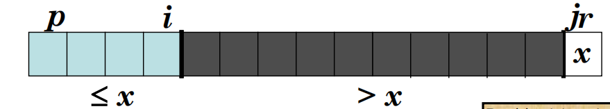

算法最后一步交换：A[i+1]与A[r]，

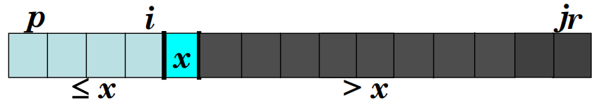


**最坏发生在**：划分时恒将两个子问题规模划分为1和n-1，此时序列本身有序；

**平均时间复杂度**：通过划分等概率的假设，累加求平均，然后得到可以使用乘n后交错相减法的式子，计算T(n)的解，最后看出p级数与logn同阶，得到T(n) = O(nlogn) 

**解决方法**：

1. 随机划分：randomized-partition(A,l,r)

   ​	i = random(l,r);

   ​	A[i], A[r]交换

   ​	return partition(A,l,r)

2. randomized-quicksort(A,l,r)，使用m=randomized-partition(A,l,r)，再递归调用

**复杂性**：划分用树来表示，划分点是根，子问题是子树；

​	根必须与子树的所有节点比较；不同子树中节点不可能比较；两个节点比较至多一次；

​	$X_{ij}$是$rank_i$与$rank_j$比较次数的随机不变量，比较过就是1，否则是0；

​	$T(n) = E(\sum \sum X_{ij}) = \sum \sum E(X_{ij})=\sum\sum p_{ij}$;

​	$Z_{ij}=\{x_{(i)},x_{(i+1)},\ldots,x_{(j)}\}\text{是}x_{(i)}\text{和}x_{(j)}\text{之间元素集合}$,

​	只有全部元素在同一个子树中时才有可能被比较;这些点，等可能被选作根，那么比较的概率就是$p_{ij} = 2/(j-i+1)$

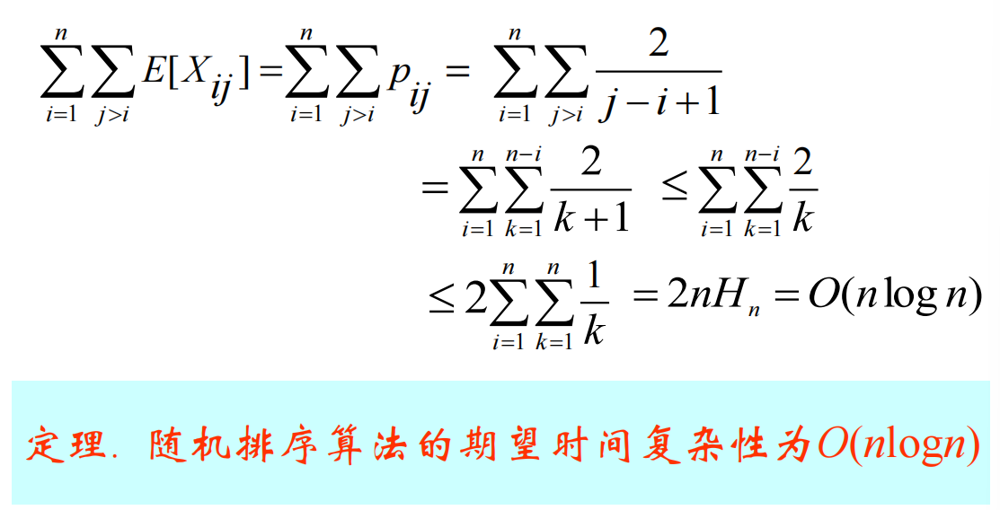


### 3.2.2 算法的下界

​	**问题的下界**：一般指**最坏时间复杂度**，是解决该问题的任意算法所需要的最小时间复杂度；是问题难度的一种度量；时间复杂度低，简单，否则难；

​	**问题的下界不唯一**：下界应该尽可能高，达到上限；

​	如果一个问题的最高下界和最好算法的时间复杂度一致，说明这个算法是**最优的**；


**排序的下界**：**二叉决策树**（基于比较和交换的排序算法）

​	内节点表示比较操作，叶节点是所有被比较元素的全排列；

​	当$n$个元素需要排列时，对应有$n!$中不同排列，排序过程对应于一个高度为$h$，具有$n!$个叶子节点的二叉决策树，由于高度$h$的二叉决策树至多有$2^h$个叶子节点，那么$2^h>n!$，$n! = \sqrt{2\pi n}(n/e)^n$,$h \ge log(n!) = \Omega(nlogn)$

总之n!是高于$n^n$阶的，$n!>(n/2)*(n/2 + 1)*...*n >(n/2)^{n/2}$


### 3.3 线性时间的排序

**计数排序**：稳定，非原地排序（外部排序指使用外存）

​	输入：$A[1..n], 0 \le A[i] \le k $

​	输出：$B[1..n]$

​	思路：使用计数$C[1...k]$来计算B中对应的位置;

伪代码：$O(n+k)$

```
for i = 0 to k, do
	c[i] = 0;
for j = 1 to length[A],do
	c[A[j]]++;
for i = 2 to k
	c[i] = c[i] + c[i-1];
for j = length[A] to 1
	B[C[A[j]]] = A[j];
	c[A[j]] -= 1;
```


**基数排序**：稳定$O(d(n+k))$

使用基数排序作为一趟排序的稳定排序算法；

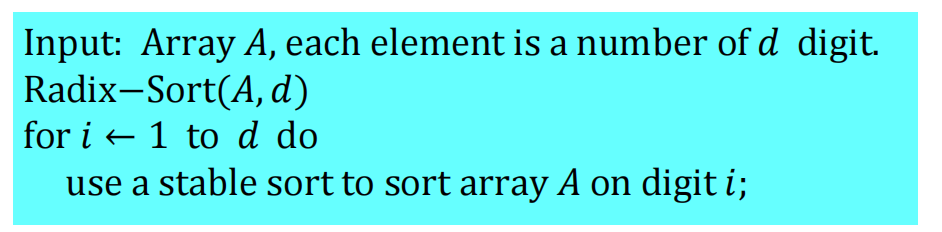

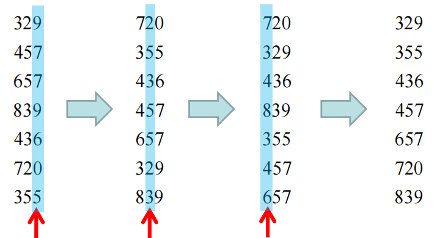

**扩展基数排序**：$\theta((b/r)(n+2^r))$

​	现在每一个数字有b位，将每r位看作是一位，共有$d=b/r$位，然后对每一位使用基数排序,$k=2^r$；

​	$r=log(n),时间复杂度=\theta(bn/logn)$

**桶排序**：可以排序浮点数；


​	如将$[0,1)$均匀分为n个等大小的桶，然后分配所有元素到这些桶中，每个桶中元素使用其他排序算法，最后连接；

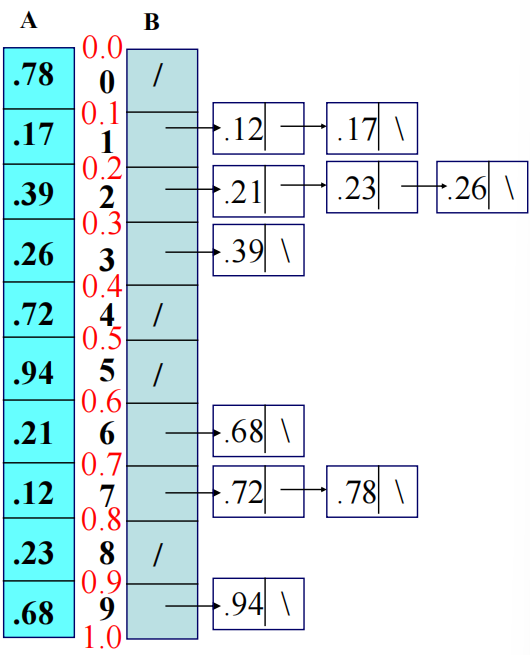

时间复杂度：

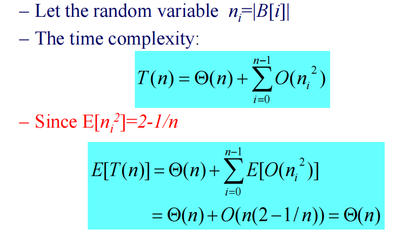

### 3.4 Medians and Order Statistics 中位数以及顺序统计问题

**减治原理**：原始问题划分为多个子问题，将原始计算问题转换为某一个子问题的计算问题；如：折半查找：$T(n) = T(\lfloor n/2 \rfloor) + 1$

如：

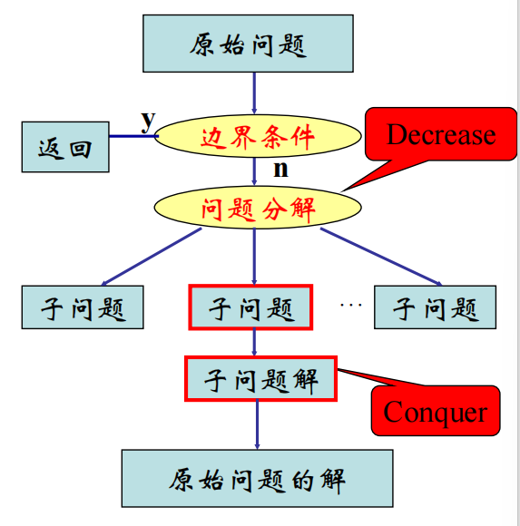

分治 vs 减治 | divide and conquer VS decrease and conquer

​	**分治**：递归**求解每一个子问题**，然后通过合并各个子问题的解最后的到原始问题的解；

​	**减治**：仅通过**求解某一个子问题的解**得到原始问题的解；


#### **Selection问题**：找到S中第i小的元素

​	特殊：1st order:找到最小的；nth order：找到最大的；median ：n为奇数时，median = (n + 1) / 2, n 为偶数时，median = n/2 and (n/2 + 1);

​	假如使用：排序后查找$O(nlogn)$

​	通过selection可以降到$O(n)$

​	

**思路**：通过减治降低问题的规模

​	将原有集合$S$用$p$划分乘三个子集合$S_1,S_2,S_3$,代表比p小的，和p相等的，比p大的三个集合；此时会有**三种情况**：

（1）当$|S_1|>k$，那么在第k小的元素在$S_1$中，递归查找$S_1$;

（2）当$|S_1|<k,|S_1|+|S_2|>k$，说明第$k$小的元素就是p；

（3）当$|S_1|+|S_2|<k$，说明第k小的元素在$S_3$中，那么递归搜索$S_3$中，第$k-|S_1|-|S_2|$小的元素；


**问题一**：寻找p

​	将n个元素划分成每五个一组，然后寻找五个一组中的中位数，此时再在$\lceil n/5 \rceil$个元素中找中位数，找中位数的问题规模被将为了$n/5$；

**问题二**：划分成三个集合后，递归求解这三种情况的最大代价

​	不严格：小于p的元素个数至少有 n/4，那么大于p的元素个数至多有 3n/4；同理，小于p的元素个数至多有3n/4。那么$max\{T(3n/4),T(3n/4)\} = T(3n/4)$;

​	严格：计算小于p的**至多元素个数**时，只需要计算大于p的**至少元素个数**：不考虑不完整的列，如p所在列和最右侧未被填满的列，即一个1/4区域内的元素个数至少有$3(\lceil \frac{1}{2} \lceil \frac{n}{5} \rceil\rceil - 2)$,那么一个补集区域内的元素个数至多有$n - (*) = \frac{7n}{10} + 6$个元素；

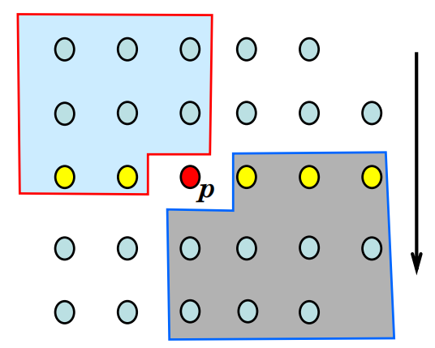

算法过程：

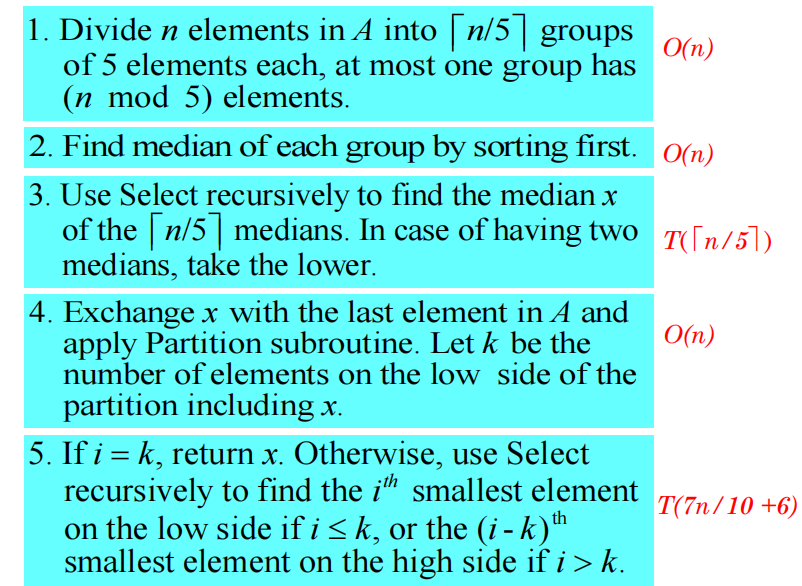

所以有**递归代价方程**：

$$T(n)\leq\begin{cases}\theta(1)&\mathrm{if~}n\leq140\\T(\lceil n/5\rceil)+T(7n/10+6)+O(n)&\mathrm{if~}n>140&&\end{cases}$$

采用数学归纳法可以证明，$T(n)=O(n)$

### 3.5 寻找最近点对

​	通过优化**combine**，该例优化 $T(n)=aT(n/b)+f(n)\text{中的}f(n)$

​	**输入**：欧式空间中n个点的集合$Q$

​	**输出**：$A,B \in Q$，并且$dis(A,B)=Min\{dis(P_i,P_j)\}$

**一维空间**：

​	排序：按照有序集合的**线性扫描**找到最近点对；$O(nlogn)$

​	分治：$O(nlogn)$

​		边界条件：如果Q中仅包含两个点，则返回这个点对；

​		Divide：找到Q中所有点的中位数m，然后划分成$[p_1,p_m] [p_{m+1},p_n]$；$O(n)$

​		conquer：递归找两个子问题的最近点对；2T(n/2)

​		combine：比较左右子问题的解，和$(p_m,p_{m+1})$，三个解的大小，返回三个解中最小值；O(1)

**二维空间**：$O(n)$ | 假设未排序时$O(nlogn)$

​	假设：Q中的点已经分别按照x,y的坐标排序放在了X,Y中

​	**边界条件**：假如仅剩三个点，则返回最近点对；

​	Divide：计算Q中横坐标的中位数，然后使用l:x=m来将Q划分成左右大小相同的子集$Q_L,Q_R$；维护$X_L,X_R | Y_L,Y_R$；

​	conquer：递归求左右两个集合中的最近点对:$(p_1,p_2) \in Q_L,(q_1,q_2) \in Q_R$，距离为$d_1,d_2$；

​	merge：在临界区中找距离小于d的最近点对$(p_l,q_r)$；若找到，那么该临界区中的点对是最近点对，否则是两子集当中的最近点对；

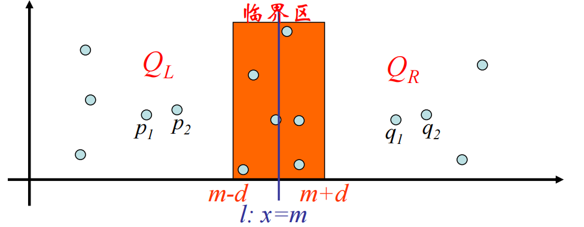

问题：如何找到临界区中的最近点对

$(p_l,q_r)$搜索算法：

​	维护$Z_L,Z_R$是左右集合中的临界区点

伪代码: $O(6n) = O(n)$

$$\begin{aligned}&1.\quad Z_L=\{Q_L\text{ 中左临界区点 }\};Z_R=\{Q_R\text{ 中右临界区点 }\};\\&2.\quad \mathrm{~For~}\quad\forall p(x_p,y_p){\in}Z_L\mathrm{~Do}\\&3.\quad \quad\mathrm{~For~}\forall q(x_q,y_q){\in}Z_R\mathrm{~Do}\quad(y_p{-}d{\leq}y_q{\leq}y_p{+}d)\\&\quad \text{“这样点至多6个”}\\&4.\quad \quad\mathrm{~If~}Dis(p,q){<}d\\&5.\quad\quad\mathrm{~Then~}d{=}Dis(p,q),\text{记录}(p,q);\quad l\\&6.\quad \text{ 如果}d\text{发生过变化},\text{与最后的}d\text{对应的点对即为}(p_l,q_r),\\&\text{不列不存在}(p_l,q_r).\end{aligned}$$


总递归方程：

$$T(n)=O(1),n \le 3\\ T(n) = 2T(n/2)+O(n),n>3\\T(n)=O(nlogn)$$


临界区：**对于左侧的$Z_L$的任意一个点，至多在$Z_R$有6个与之距离值小于d的点**

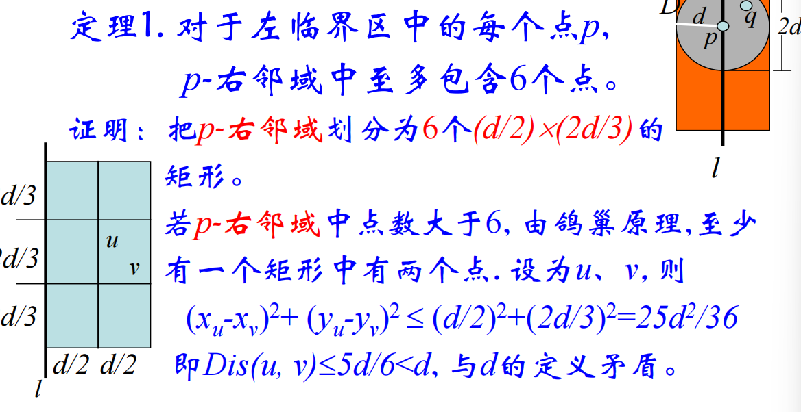

搜索算法：$Z_L,Z_R$点按照y值升序排列，然后遍历$Z_L$，在$Z_R$找可能符合的点。

1. 遍历所有左侧点；
2. 当右侧点的y值小于左侧点＋d时，右侧指针下移；
3. 当左侧点的y值处于右侧点的d邻域时，将左侧点和右侧点及之后共六个点的距离计算出来比较，若<d，则更新d和最近点对。
4. 直到所有$Z_L$中点遍历结束；


伪代码：可看可不看 找$(p_l,q_r),O(n)$

```
Input: YL, YR, d
Output: result
1. 	扫描YL得到QL 中左临界区点, 保持y坐标排序, 得到ZL
2. 	扫描YR得到QR 中左临界区点, 保持y坐标排序, 得到ZR
3. 	result=null; 
4. 	top-R=0;
5. 	for top-L=0 to ZL.length-1
6.		 while ZL[top-L].y > ZR[top-R].y + d
7. 			if top-R=ZR.length-1
8. 				return result; 
9. 			top-R ← top-R+1;
10. 	if ZL[top-L].y ≥ ZR[top-R].y – d and 
			ZL[top-L].y ≤ ZR[top-R].y + d
11. 		for i=0 to min{5, ZR.length –top-R – 1}
12. 			if dist(ZL[top-L], ZR[top-R+i])<d
13. 				result=(ZL[top-L], ZR[top-R+i]);
15. 				d=dist(ZL[top-L], ZR[top-R+i]);
16. return result;
```


### 3.6 凸包

凸包：是一个最小的凸多边形P，使得Q中的点要么在P内，要么在P上。

​	性质：连接P上任意两点的边在P内;

​	输入：平面上n个点的集合$Q$；

​	输出：$CH(Q)$:Q的convex hull；

基本思想：沿着convex hull逆时针遍历时，总是向左旋转；

​	**找到凸包的方法**：将Q在极坐标下**按照极角大小排序**，然后逆时针遍历，除去**非左转**的点（即非convex hull点）；

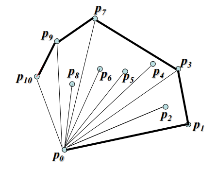

伪代码：$O(n) + O(nlogn) = O(nlogn)$

```
1. 	求Q中y-坐标值最小的点p0；
2. 	按照与p0极角(逆时针方向)大小排序Q中其余点，结果为<p1, p2, …, pn>；
3. 	Push p0, p1, p2 into S;
4. 	FOR i=3 TO n DO
5. 		While Next-to-top(S)、Top(S)和pi形成非左移动 Do
6. 			Pop(S);
7. 		Push(pi, S);
8. 	Rerurn S
```


**循环不变量证明正确性**：

​	**定义循环不变量**：处理第i个顶点之前，栈中自底到顶存储$CH(Q_{i-1})$的顶点；

​	初始阶段：第三步包含了p0,p1,p2

​	维持阶段：设处理第i个节点之前，存放了$CH(Q_{i-1})$，证明执行5-7后，存放了$CH(Q_{i})$: 5,6步结束后，栈顶元素是$p_j$，此时到了第j轮循环的结果$CH(Q_{j})$，而在之前被弹出的顶点不满足左向旋转，即不在闭包中$CH(Q_{i})$，第8步之后，push（pi），此时栈中存放的均为左向旋转的点集，即是$Q_i$的闭包$CH(Q_i)$。

​	终止阶段：i=n+1是，栈中存放的是CH(Qn)，算法正确；


分治思路：$O(nlogn)$

​	边界条件：（1）集合中点个数小于三，直接终止；（2）=3，按照逆时针方向输出CH(Q)；（3）<5，使用graham-scan（就是上面按极角排序，维护凸包栈的算法）

​	divide：使用selection求横坐标中位数($O(n)$)，分成$Q_L,Q_R$；

​	conquer：递归为$Q_L,Q_R$构造$CH(Q_L),CH(Q_R)$;

​	merge：（1）找到$Q_L,Q_R$中y坐标最小的点p；（2）在$CH(Q_R)$中找到与p极角最大和极角最小的顶点u,v；（3）构造三个序列：逆时针的$CH(Q_L)$；按逆时针方向排列的$CH(Q_R)$从*v*到*u*的顶点；按顺时针方向排列的$CH(Q_R)$从*v*到*u*的顶点;（4）三个有序序列归并；（5）应用graham-scan，选出最后的闭包；

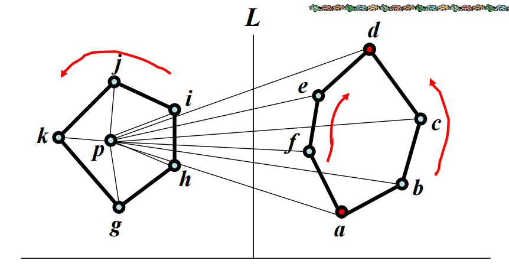

### 3.7 快速傅里叶变换

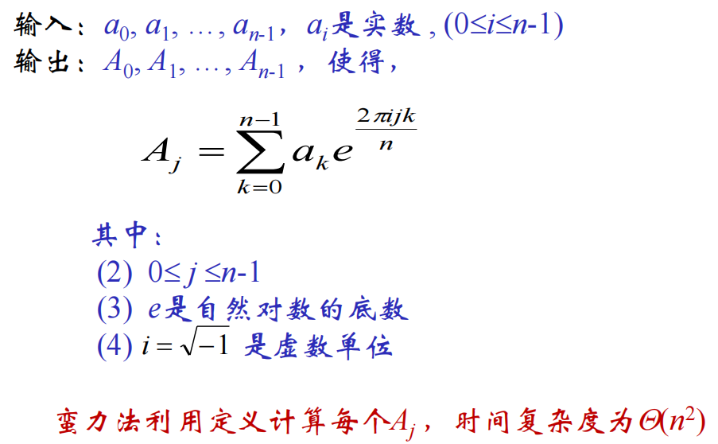

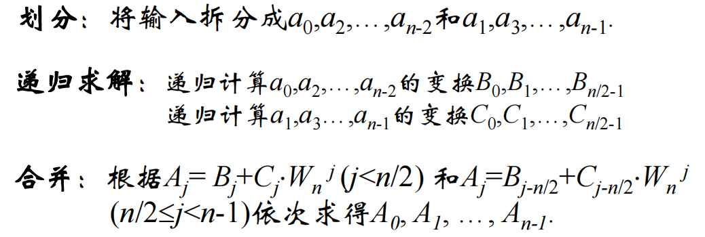

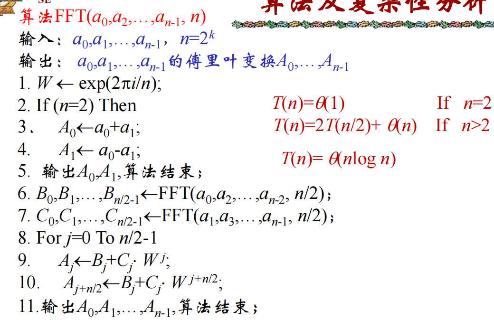

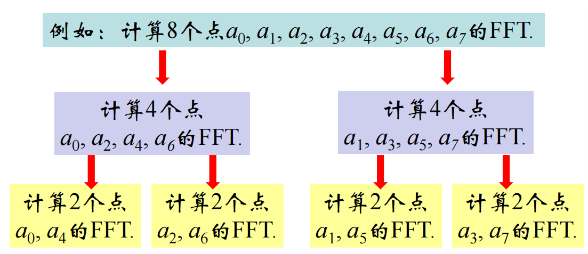

### 3.8 整数乘法

优化划分阶段，降低$T(n)=aT(n/b)+D(n)+C(n)$中的a

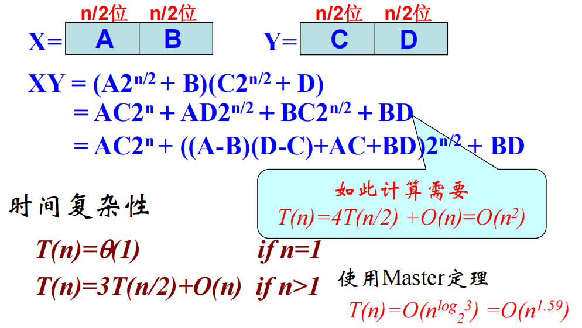


## 动态规划

导学：动态规划的元素；矩阵链乘法；最长公共子序列；0/1背包；最优二叉搜索树 ；

### 4.1 动态规划的元素

​	**分治算法(divide and conquer)的问题**：当子问题不是相互独立的，分治算法将重复计算公共子问题，效率很低；

​	**优化问题**：在**解空间**中找到一个**优化解**；

每个可行解都有一个**代价**；优化问题要解决的是：在所有可行解（解空间）中找到**优化解**（代价最大或者最小的可行解，**最优解**）；最优解**不一定唯一**；

> 应用场景：最短路径--迪杰斯特拉，旅行商--FSP，任务调度等；

​	**动态规划**是解决优化问题的一个方法；**多阶段决策**（一个阶段的决策会影响下一个阶段的决策） + **最优性原理**；

​	

​	**思路**：将原始问题划分成一系列子问题，**不同子问题的数目之和只有多项式量级**；自底向上求解每一个子问题，每个子问题只求解一次并记录下来，保证不同的子问题只求解一次；

​	**适用范围**：有限子问题数目 | 子问题重叠性 | 优化子结构

​	**优化子结构**：一个问题的优化解包含了子问题的优化解；

​	**重叠子问题**：很多子问题被多次使用；

​	

**算法设计步骤**：

		1. 分析**优化子结构**；
		1. **递归定义优化解代价**；
		1. **递归划分**子问题，直至不可分，同时可以分析子问题重叠性；
		1. **自底向上**求解子问题（需要时：构造最优解的信息）；
		1. 根据构造最优解的信息构造最优解；

### 4.2 矩阵链乘法

​	**输入**：$<A_1,A_2,...,A_n>, A_i 是p_{i-1} \times p_{i}矩阵$；

​	**输出**：计算$A_1\times A_2\times...\times A_n$的最小代价；

​	**代价**：A是$p \times q$矩阵，B是$q \times r$矩阵，$A \times B$代价是 $O(pqr)$；

设计矩阵链动态规划算法（按照上述算法设计步骤来）：

**优化子结构**：

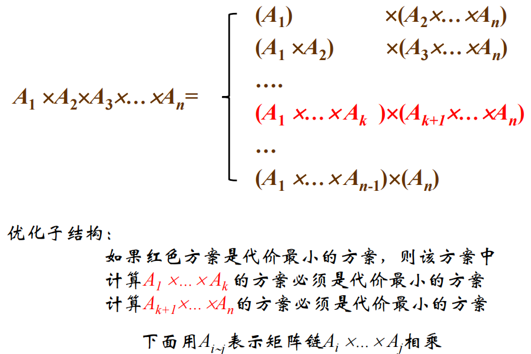

**优化解代价**：$cost_{i\to j} = min_{k \in Z[i,j-1]} \{cost_{i\to k} + cost_{k+1 \to j} + p_{i}p_{k}p_{j}\}$

**代价方程**：此时，$m[i,j]$为对应从矩阵i计算到矩阵j的代价

​	$m[i,j] = 0,if \quad i=j$

​	$m[i,j] = min_{i \le k<j}\{m[i,k] + m[k+1,j] +p_{i-1}p_{ik}p_{j}\},if \quad i<j$

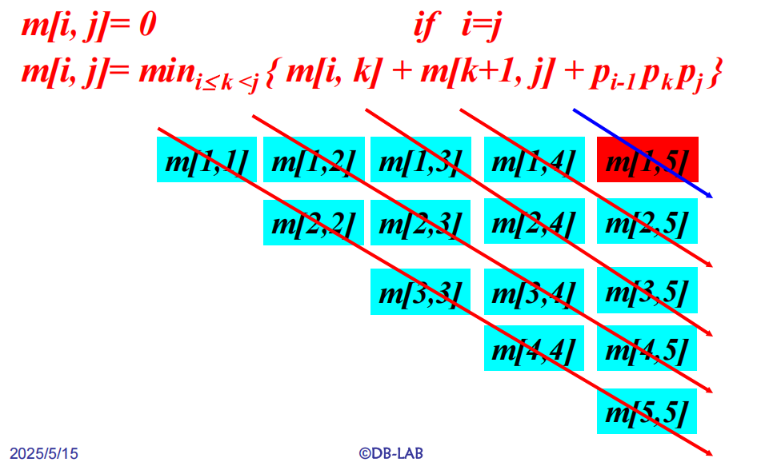

**伪代码**：$O(n^3)$

```
Matrix-Chain-Order(p)
n=length(p)-1；
FOR i=1 TO n DO
 	m[i, i]=0;
FOR l=2 TO n DO /* 计算对角线 */
	FOR i=1 TO n-l+1 DO
 	j=i+l-1;
	m[i, j]=∞; 
	FOR k <- i To j-1 DO /* 计算m[i,j] */
		q = m[i, k]+m[k+1, j] + pi-1 *  pk * pj
		IF q<m[i, j] THEN m[i,j]=q; s[i,j] = k;
Return m and s.
```

**构造答案**：$O(n)$

```
Print-Optimal-Parens(s, i, j)
 IF j=i
 	THEN Print “A_i”
 ELSE Print “(”
 	Print-Optimal-Parens(s, i, s[i, j])
 	Print-Optimal-Parens(s, s[i, j]+1, j)
 	Print “)”
```

### 4.3 最长公共子序列

**预备知识**：子序列，公共子序列；

​	**子序列**：

​	$X = <x_1,x_2,...,x_n>$；

​	任意严格递增序列$<i_1,i_2,...,i_k>, 1 \le i_1, i_k \le m,$$ Z = <z_1,z_2,...,z_k> = <x_{i_1},x_{i_2},...x_{i_k}>$是X的子序列

​	**公共子序列**：Z是序列X,Y的公共子序列，当且仅当Z是X的子序列，也是Y的子序列；


**最长公共子序列（LCS）问题**:

​	输入：$X=(x_1,x_2,...,x_m)$, $Y=(y_1,y_2,...,y_n)$；

​	输出：X Y 的公共子序列 $Z = (z_1,z_2,...,z_k)$；

​	第i前缀：$X_i = (x_1,x_2,...x_i)$；

​	**优化子结构**：当X,Y的LCS为$LCS_{XY} = (z_1,z_2,...,z_k)$

​		if $x_m = y_n$，则$LCS_{XY} = LCS_{X_{n-1}Y_{n-1}} + <x_m = y_n>$；

​		if $x_m \neq y_n$，且$z_k \neq x_m$，则 $LCS_{XY}=LCS_{X_{m-1}Y}$；

​		if $x_m \neq y_n$，且$z_k \neq y_n$，则 $LCS_{XY}=LCS_{XY_{n-1}}$；

​	**递归方程**：$C[i,j]$是$X_i,Y_j$的最长公共子序列；

​		$C[i,j] = 0,if \quad i=0 \,  || \, j=0$;

​		$C[i,j] = C[i-1,j-1] + <x_i = y_j> , if \quad x_i = y_j \,\,\, \&\& \,\,\,i ，j > 0$;

​		$C[i,j] = max(C[i-1,j],C[i,j-1]),if \quad x_i \ne y_j \,\, \&\& \,\, i,j>0 $;

​	**计算长度及构造最优解的数据结构**：

​		$C[0:m,0:n] : C[i,j]$是$X_i,Y_j$的LCS；

​		$B[1:m,1:n]:B[i,j]$记录优化解的信息；

​	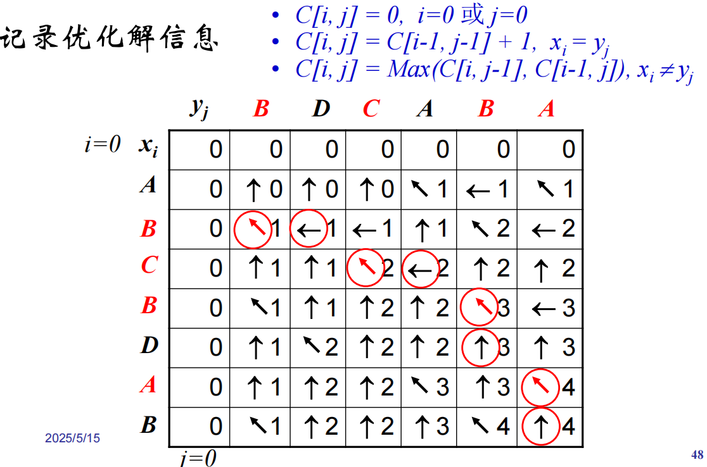

**伪代码**：$O(mn)$

```
LCS-length(X, Y)
m=length(X)；n=length(Y)；
For i=0 To m Do 
	C[i,0]=0;
For j=1 To n Do 
	C[0,j]=0;
For i=1 To m Do
	For j=1 To n Do
		If x[i]= y[j] Then
			C[i,j] = C[i-1,j-1]+1；
			B[i,j]=“0”; // 0表示指向 [i-1,j-1]
		Else If C[i-1,j] >= C[i,j-1]
		Then C[i,j] = C[i-1,j];
			B[i,j]=“1”; // 1 表示指向 [i-1,j]
		Else C[i,j]=C[i,j-1]; 
			B[i,j]=“2”;// 2 表示指向 [i,j-1]
Return C and B.
```

**构造最优解**：$O(m + n)$

```
Print-LCS(B, X, i, j)
If i=0 or j=0 Then Return;
If B[i, j]=0 
Then Print-LCS(B, X, i-1, j-1); Print xi;
Else 
	If B[i, j]=“1”
	Then Print-LCS(B, X, i-1, j);
 	Else Print-LCS(B, X, i, j-1).
```

### 0/1背包问题 knapsack

**问题定义**：给定n种物品一个背包，物品i的重量是$w_i$，价值$v_i$，背包承重$C$，问：如何选择装入背包的物品，使装入背包中的物品的总价值最大；每个数值均为**整数**；

注意：每种物品只能选择完全装入或不装入，一个物品之多装入一次；

​	**输入**：$C>0,w_i>0,v_i>0,1 \le i \le n$

​	**输出**：$(x_1,x_2,...,x_n),x_i \in \{0,1\}$，满足$\sum_{1 \le i \le n}w_ix_i \le C$， $\sum_{1 \le i \le n}v_ix_i$最大；

​	**问题Pi划分**：$P_i: {i, i+1,...,n},C- \sum_{1 \le k \le i-1}w_kx_k$，$max\sum_{i \le k \le n}v_kx_k$，其中：重量要求$\sum_{i \le k \le k}w_kx_k \le C - \sum_{1 \le k \le i-1}w_kx_k$，$x_k \in \{0,1\}$；

​	**优化子结构**：当$S_i=(y_i,y_{i+1},...,y_n)$是0/1背包子问题$P_i=[{i,i+1,...,n}，C_i = C -\sum_{1 \le k \le k-1}w_ky_k]$的优化解，那么$S_i=(y_{i +1},y_{i + 2},...,y_i)$是如下子问题$P_{i+1}$的优化解：

​	$max \sum_{i+1 \leq k \leq n} v_k x_k$，$\sum_{i+1 \leq k \leq n} w_k x_k \leq C_i - w_i y_i$，$x_k \in \{0, 1\}, \quad i+1 \leq k \leq n$；

​	**递归方程**：定义代价矩阵m，m[i,j]表示子问题$ [(i, i + 1, ... , n), j] $的优化解的代价，$m(i,j)=\sum_{i\leq k\leq n}\nu_kx_k$；

​	$$\begin{aligned}&m(n,j)=0,\quad0\leq j<w_n\\&m(n,j)=v_n,\quad j\geq w_n\\&m(i,j)=m(i+1,j),0\leq j<w_i\\&m(i,j)=\max\{m(i+1,j),m(i+1,j-w_i)+v_i\},\quad j\geq w_i\end{aligned}$$

​	**递归划分子问题**：

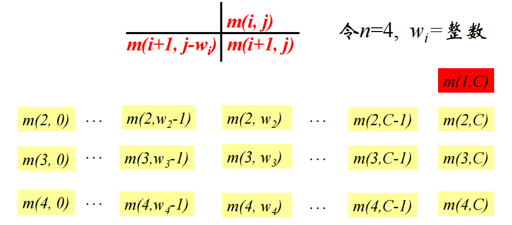

​	**自底向上计算优化解的代价，记录构造优化解的信息**：

伪代码：$O(Cn)$ 背包的大小 * 物品的数量

```
For j=0 To min (w_n-1, C) Do
 	m[n, j] = 0;
For j=w_n To C Do
 	m[n, j] = vn;
For i=n-1 To 2 Do
 	For j=0 To min(wi -1, C) Do
 		m[i, j] = m[i+1, j];
 	For j=wi To C Do
 		m[i, j]=max{m[i+1, j], m[i+1, j-wi]+vi};
If C<w1 Then m[1, C]=m[2, C];
Else m[1, C]=max{m[2, C], m[2, C-w1]+v1};
```

构造优化解：$O(n)$

```
ConstructOptimal(m, i, j)
If m(i,j) = m(i+1,j) ;
Then x_i = 0; construct(m, i+1, j);
Else X_i = 1; construct(m, i+1, j-w_i);

Construct(M)
X=construct(m,1,C);
```

部分背包问题：使用贪心解决即可
	贪心策略：每次放入单位价值最大的物品；

### 4.5 最优二叉搜索树

**预备知识**：二叉搜索树

​	节点集合：$K={k_1,k_2,...k_n}$对应搜索的具体键值；$D={d_0,d_1,...,d_n}$对应搜索的区间，如$d_i = (k_i,k_{i+1}), special: d_0 = (-\infty,k_1),d_n=(k_n,+\infty)$；

​	附加信息：搜索$k_i$的概率为$p_i$,搜索$d_i$的概率为$q_i$，$\sum_{i=1}^np_i+\sum_{j=0}^nq_j=1$

**问题定义**:

​	**输入**：

​		$$\begin{aligned}\text{}&K=\{k_l,k_2,\ldots,k_n\},k_l<k_2<\ldots<k_n,\\&P=\{p_l,p_2,\ldots,p_n\},p_i\text{为搜索}k_i\text{的概率}\\&Q{=}\{q_0,q_l,\ldots,q_n\},q_i\text{为搜索值}d_i\text{的概率}\end{aligned}$$

​	**输出**：构造最小的二叉搜索树T，最小化  $$E(T)=\sum_{i=1}^n(DEP_T(k_i)+1)p_i+\sum_{i=0}^n(DEP_T(d_i)+1)q_i$$

​	**优化解结构**：$K=\{k_1,k_2,\ldots,k_n\}$的优化解的根必为某个$k_r$

​	**优化子结构**：如果优化二叉树包含关键字集合$\{k_i,k_{i+l},\ldots,k_j\}$的子树T'，那么T'就是关于关键字集合$\{k_i,k_{i+l},\ldots,k_j\}$的子问题优化解（这个表示中间还可以有多层，那么T‘是T的左右子树时，自然也成立）；

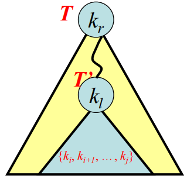

$E_{T^{\prime}}(T)=\sum_{x=i}^{j}(DEP_{T}(k_{x})+1)p_{x}+\sum_{x=i-1}^{j}(DEP_{T}(d_{x})+1)q_{x}$

​	$=\sum_{x=i}^{j}(DEP_{T^{\prime}}(k_{x})+1)p_{x}+\sum_{x=i-1}^{j}(DEP_{T^{\prime}}(d_{x})+1)q_{x}+(DEP_{T}(k_{l})-DEP_{T^{\prime}}(k_{l}))(\sum_{x=i}^{j}p_{x}+\sum_{x=i-1}^{j}q_{x})$

前两个和式为**子问题的优化解代价方程**，后一个和式为从子问题推导出父问题时的**代价差值**；

​	**递归方程**：

​	$令E(i,j)为\{k_i,...,k_j\}的优化解T_{ij}的期望搜索代价$

​	$\begin{aligned}&\text{当}j{=}i{-}l\text{ 时,}T_{ij}\text{中只有叶结点}d_{i-l},E(i,i{-}l){=}q_{i-l};\end{aligned}$	

​	$E(i,j)=P_r+E(i,r-l)+W(i,r-l)+E(r+l,j)+W(r+l,j)$

​	$E$为代价值；$P_r$为搜索到该子问题$(i,j)$的根节点$r$的概率，$W=(DEP_{T}(k_{l})-DEP_{T^{\prime}}(k_{l}))(\sum_{x=i}^{j}p_{x}+\sum_{x=i-1}^{j}q_{x})$ 为从子问题推到父问题的代价差值（子树增加在父问题里面的深度，这里为1）；


**递归方程化简**：$E(i,j)=min_{i \le r \le j}(E(i,r-1)+E(r+1,j)+W(i,j))$；

**边界条件**：当$i > j，即j = i-1,E(i,j) = q_j$；

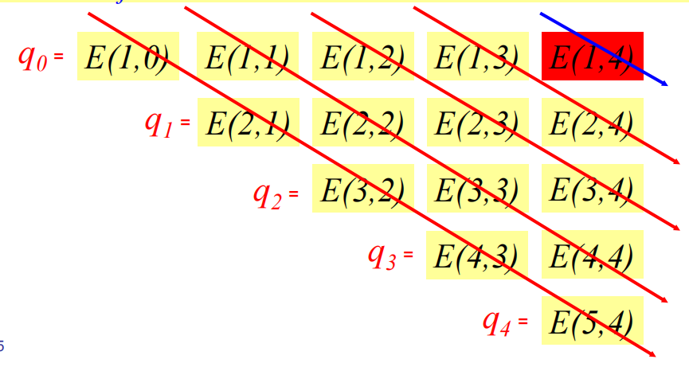

**数据结构**：$E[1:n+1]$：存储优化解搜索代价；

​		$W[1:n+1,0:n]$:存储优化解代价增量；

​		$Root[1:n;1:n]$:Root(i,j)记录子问题{i,...,j}的优化解的根;

**伪代码**：time:$O(n^3)$, space:$O(n^2)$

```
Optimal-BST(p, q, n)
For i=1 To n+1 Do
	E(i, i-1) = qi-1; 
	W(i, i-1) = qi-1;
For l=1 To n Do
	For i=1 To n-l+1 Do
 		j=i+l-1; 
 		E(i, j)=inf;
 		W(i, j)=W(i, j-1)+pj+qj;
 		For r=i To j Do
 			t=E(i, r-1)+E(r+1, j)+W(i, j);
 			If t<E(i, j)
 			Then E(i, j)=t; Root(i, j)=r;
Return E and Root
```

**构造优化解**：

```
Extend(Root, n)
(i, j) ← n.range;
If i > j
	n.label ← 𝑑𝑗;
Return;
n.Label ← 𝑘_𝑅𝑜𝑜𝑡[𝑖,𝑗];
L ← Root[i, j];
Initiate node lc;
lc.range ← (i, L-1);
n.leftChild ← lc;
Initiate node rc;
rc.range ← (L+1, j);
n.rightChild ← rc;
Extend(Root, lc);
Extend(Root, rc);
```

总结：

1. 原始问题可以划分成一系列子问题，子问题之间不是相互独立的
2. 不同子问题的数目常常只有多项式量级
3. 解决过程
   1. 优化子结构
   2. 优化解的结构分析
   3. 建立优化解代价的递归方程
   4. 递归地划分子问题
   5. 自底向上计算优化解的代价，记录优化解的构造信息
   6. 构造优化解


## 贪心算法

### 5.1 贪心算法的基本原则

**Greedy的基本概念**

​	贪心算法总是作出在当前看来最好的选择：贪心算法并不从整体最优考虑，它所

作出的选择只是在某种意义上的局部最优选择；

**用途**：求解最优化问题

**基本思想**：算法包含一些列步骤，每一步都有一组选择，决策时选择当前最好的选择；希望通过局部优化选择达到全局优化选择；

​	不一定能得到全局最优解可能存在，可能存在多种贪心策略；、

应用：硬币选择问题——贪心策略：选择当前面值最大的硬币——策略错误；

应用2：区间调度问题（活动选择）

​	**输入：**n各活动区间的集合{[*s1* , *f1* ],[*s2* , *f2* ],…[*s_n* , *f_n* ]}，*s*_i是区间*i*的起始时间，f_i是终止时间；

​	**输出：**具有最多相容区间的调度；

​	**贪心策略：**选择具有最早结束时间的活动；

**Greedy算法产生优化解的条件**：

 1. 优化子结构：一个优化问题的优化解包含它的（剩余）子问题的优化解；

 2. Greedy选择性(greedy_choice property)：一个优化问题的全局优化解可以通过局部优化选择得到；

    换言之：任一实例都存在**至少一个优化解**包含 在这个实例上使用贪心算法 做出的**第一个选择**；

**贪心算法正确性证明**：

​	**交换论证法**：保证最优性不变，从一个最优解逐步替换，最终得到贪心算法的解；

​	1. 贪心算法一定能够找到一个与其他优化解一样优化的解；

​	2. 贪心选择性 做出的选择至少包含在一个优化解中，证明**贪心选择性**和**优化子结构** + **隐含的归纳法**；

​	**归纳法**：对算法步数归纳 | 对问题规模归纳；

​	证明在每一步都比其他算法做的好，或者做的同样好；


**Greedy 与动态规划方法的比较**

​	动态规划：优化子结构 + 子问题重叠性；

​	贪心算法：优化子结构 + greedy选择性；

​	都有对应的适用范围，如0-1背包问题，部分背包问题；


**Greedy的设计步骤**

 	1. 设计贪心选择方法：贪心策略 + 剩余子问题；
 	2. 证明：对于1中的贪心选择来说，所求解的问题具有**优化子结构**；
 	3. 证明：对于1中贪心选择来说，求解的问题具有**greedy选择性**；
 	4. 按照1中策略设计算法；

### 5.2 活动选择问题

​	**输入：**n各活动区间的集合{[*s1* , *f1* ],[*s2* , *f2* ],…[*s_n* , *f_n* ]}，*s*_i是区间*i*的起始时间，f_i是终止时间；

​	**输出：**具有最多相容区间的调度（i, j相容：s_i >= f_j || s_j >= f_i ）；

​	**贪心策略**：每次选择f_i最小的活动；

​	**剩余子问题**：S_i = {j 属于 S | s_j >= f_i}

​	引理1：构造贪心选择性；

​	引理2：构造优化子结构 

​	**证明**: 当A时优化子结构时，对应A' 是 S' = {i | s_i >= f_1}的优化解； 反证：当不是优化解时，存在B'是优化解，那么可以有 |B| = 1 + |B'| > |A|，不成立；

​	引理3：归纳证明；//**之后不再需要**，是对基数的归纳

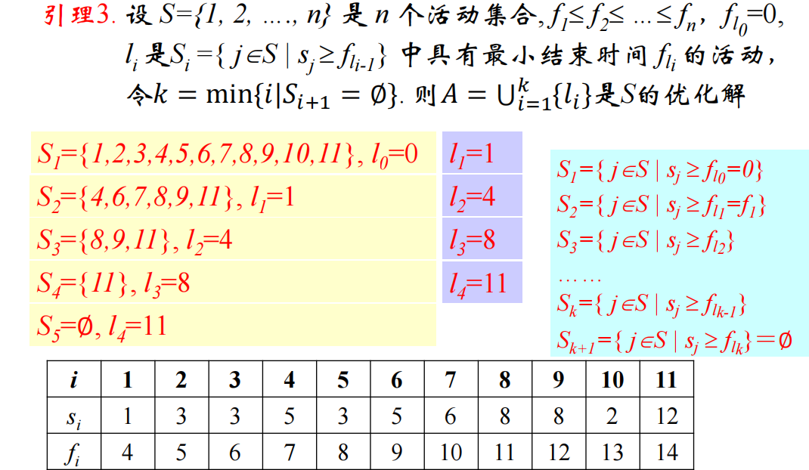

​	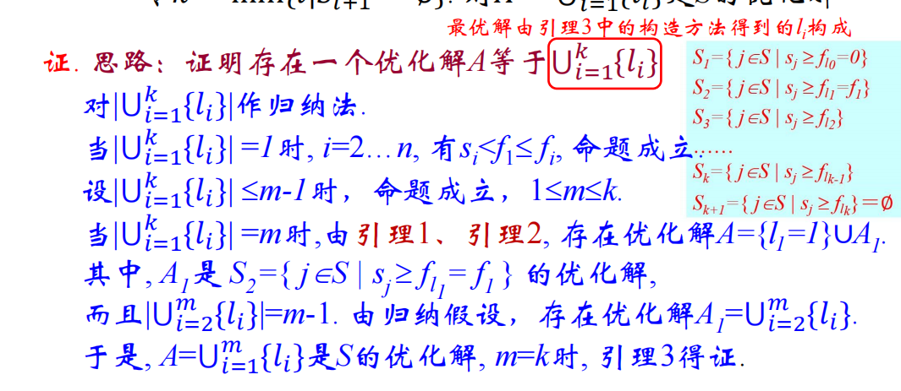

### 5.3 Huffman编码

​	预备知识：二进制字符编码；定长编码；变长编码；前缀编码；

​	recall: 前缀编码的字典树当中，不存在一个字符位于从根结点到另一个字符的路径上；

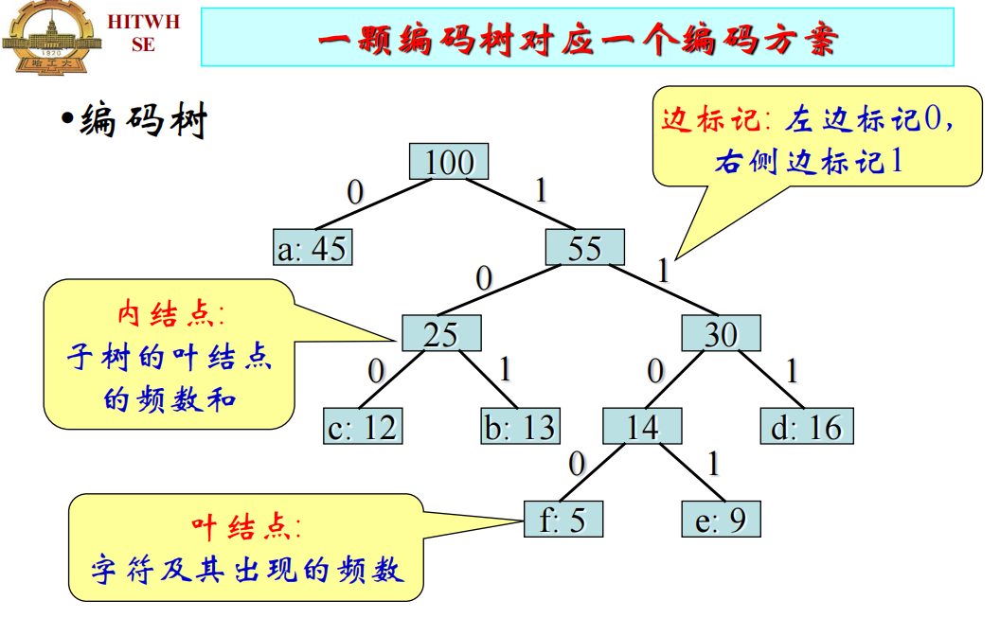

​	**编码树的代价**： ${B(T)} = \sum_{c \in \mathcal{C}} f(c) \, d_T(c)$

​	理解：两种理解思路

> 1. 当构造Huffman树时，算法每进行一步，对应两个子树的**深度增加一层**，**总代价增加两个子树包括的有叶节点频率的和**；
> 2. 总代价相当于所有内节点的代价之和，内节点的代价对应两棵子树的代价，也代表着内节点这颗树在增加该根节点（此内节点）时增加的代价；

​	优化编码树问题：

​	**输入**：字母表 $C = {c_1, c_2, ..., c_n}$，频数表 $F = {f(c_1),f(c_2),...,f(c_n)}$

​	**输出**：具有最小 $B(T)$ 的 C 的前缀编码树；

​	**贪心策略**：选择具有最低频数的两个节点 x, y，生成一棵子树 z，直至形成树；

​	**剩余子问题**：

​	$C' = C - \{x, y\} \cup \{z\}$

​	$F' = F - \{f(x),f(y)\} \cup f(z), f(z) = f(x) + f(y)$


### 5.4 最小生成树问题

导览：kruskal, prim算法

预备知识：生成树：边加权无向连通图G的生成树是无向树，整棵树的权值是生成树边权值之和；最小生成树：权值最小的生成树；

**问题定义**：

​	输入：无向连通图$G=(V,E)$,权函数$W$；

​	输出：$G$的最小生成树；

**Kruskal算法**

​	初始化：A为选定的边集，为空；$G_A=(V,A)$为对应的森林；

​	**贪心策略**：选择连接$G_A$两棵树中具有最小权值的边加入A.

​	**贪心选择性**：假如(u,v)是G中权值最小的边，则比有一颗最小生成树包含(u,v)

​		假设T是G的最小生成树，如果$(u,v) \in T$，结论成立；否则，可以添加(u,v)，必会产生包含$(u,v)$的环，然后删除环中不同于$(u,v)$的权值最小的边$(x,y)$，得到$T'$，则$w(T')= w(T) - w(x,y) + w(u,v) \le w(T)$，$T'$也是一颗最小生成树，并且包含(u,v)；

​	**剩余子问题**：假如选择的边是(x,y)间的最小边，那么剩余子问题为 $G(x,y)$；**收缩**$G/(x,y)$：用$z$代替$(x,y)$，将所有与$x,y$相邻的边连至$z$，删除$(x,y)$内部的边，其余不变。**扩张**为收缩的逆操作，记作$G|_z^{(x,y)}$.

​	**最优子结构**：假如$T$是$G$的优化解，并且$(u,v)$是最小边权。那么$T/(u,v)$是$G/(u,v)$的优化解；

​	$T/(u,v)$是$G/(u,v)$的无环连通完全图，因而是子问题的生成树；接下来证明是权值最小的连通树：若不是最小的连通树，那么存在更小的连通树$T'$，边权$W(T') < W(T/(u,v))$，则$T'' = T'|_{z}^{(u,v)}$是G的生成树，且权值更小，与T是G的最小生成树矛盾；

伪代码：$O(ElogE) + O(\alpha(n)(V+2*E)) = O(ElogE)$

```
MST-Kruskal(G(V, E), W)
	A={};
	For any v in V Do
	Make-Set(v); /* 建立只有v的集合 */
	按照W值的递增顺序排序E中的边;
	For (u, v) in E (按W值的递增顺序) Do
	If Find-Set(u) != Find-Set(v) (判断是否出现回路)
	Then A=A + {(u, v)}; Union(u, v); (合并u,v集合)
	Return A
```


**Prim算法**

​	**初始化**：选择任意节点$v_r$作为root，初始化$C=\{v_r\}$；

​	**贪心策略**：选择$C$和$V-C$之前权值最小的边$(x,y)$，其中$x \in C, y \in V-C$，然后更新$C=C \cup \{y\}$

​	**贪心选择性**：$(u,v)$是节点中与$u$关联的权值最小的边，那么必有一颗最小生成树包含边$(u,v)$

​	假设$T$是$G$的一颗最小生成树，假如$(u,v) \in T$，那么结论成立；否则，在$T$中添加$(u,v)$，则会产生环，删除环中与$u$相关联的另一条边，得到$T'$，$w(T') = w(T) - w(u,w) + w(u,w) \le w(T)$，$T'$也是一颗最小生成树，并且包含(u,v)

​	**优化子结构**：T是G的包含（u,v）的最小生成树，那么T/(u,v)是G/(u,v)的最小生成树；

伪代码：$O(ElogV)$

```
MST-Prim(G, W, r)
Input 连通图G，权值函数W，树根r
Output G的一棵以r为根的生成树

1. 	For any v in V[G] Do
2. 		key[v]=INF //C中所有顶点与v邻接的边的最小权值
3. 		pre[v] =null //与v邻接的具有最小权值的边
4. 	key[r] = 0
5. 	Q = V[G] //Q是一个最小堆
6. 	While Q != null do
7. 		u = Extract_Min(Q) 
8. 		for any v in Adj[u] do //至多遍历所有的边，O(E)
9. 			if v in Q 且 w(u,v)<key[v] then
10. 			pre[v]  = u
11. 			key[v]  = w(u,v) //更新信息，就要维护最小堆 O(logV)
12. Return A={(v, pre[v])| v in V[G] -r}
```


## 平摊分析

导学：平摊分析基本原理 | 聚集 aggregate | 会计 accounting | 势能 potential | 动态表平摊分析

### 6.1 基本原理

关注一系列数据结构上的操作的时间复杂度：$OP_1...OP_m$

​	确定这个操作序列可能花费的最长时间：考虑每一个操作的最坏情况然后求和太过于粗糙，操作之间实际上是**相互关联**的，是需要考虑**数据结构**的；

​	如：普通栈操作：$O(n)$；有Multipop(k)的栈:$O(n)$

​	**基本思想**：给定数据结构，给定n个操作的代价上界；

​		有的操作代价高，有的低：将**总的代价平均到各个操作**上，不考虑概率（不是平均分析）

三种方法：（1）**聚集方法**：计算n个操作上界T(n)，然后平均，**难用**；（2）**会计方法**：不同操作有不同的代价，某些操作可以在数据结构的特殊**对象**上预付代价，如数列的单元格；（3）**势能方法**：不同操作不同代价，预付的代价是**整个数据结构**的“能量”，即从对象代价的和考虑，不考虑单个元素；

### 6.2 聚集方法

分析操作序列中的复杂性上界：$\sum 每个操作的最坏代价$，平摊代价即是前值的平均；

例如：栈操作 | k位计数器 

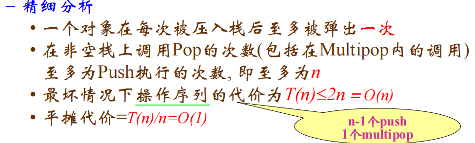

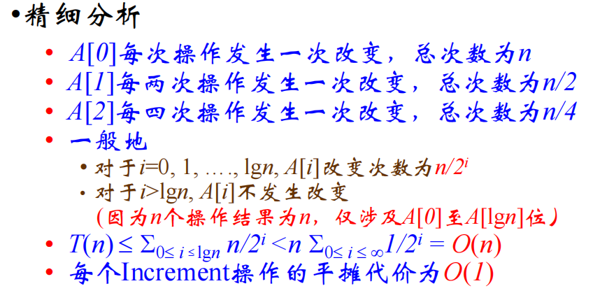

### 6.3 会计方法

为每种操作赋予不同的平摊代价：一般情况下，实际代价高的操作平摊代价低，实际低平摊高；多出来的代价用于预付在**具体数据对象**上的操作代价；

选择规则：数据结构中的credit之和在任何时候都必须非负$\text{即}\sum_{l\leq i\leq n}\alpha_i-\sum_{l\leq i\leq n}c_i\geq0\text{永远成立}$

例：

1. 栈操作：push()代价为2，两个pop()都为0；总$O(n)$
2. 二进制计数器：increment代价为2，一个支付置1，另外一个预付置0；总：$O(n)$

### 6.4 势能方法

将余额与整个数据结构关联：**余额之和**即为势能；

如果操作的平摊代价大于操作的实际代价，势能增加，否则减小；结束势能一定大于初始化时势能；

数据结构$D_0$上做n个操作到达状态$D_n$，有$\phi(D_n)-\phi(D_0) \ge 0$,那么平摊代价与实际代价有 $\alpha_i=c_i + \phi(D_i) - \phi(D_0)$；

总平摊代价有：

$\begin{aligned}\sum_{i=1}^{n}\alpha_{i}&=\sum_{i=1}^n(c_i+\phi(D_i)-\phi(D_{i-1}))\\&=\sum_{i=1}^nc_i+\phi(D_n)-\phi(D_0)\end{aligned}$

例：（1）栈的势能定义：$\phi(D_m)=D_m中元素的个数s$；（2）计数器的势能定义：$\phi(D_m)=m个操作后1的个数b_m$；

### 6.5 动态表

数据结构T：继承一维数组

​	支持插入：insert(), 删除：delete()；

​	装载因子$\alpha(T)$y要满足在确定上下界内，否则会收缩 | 扩张；（实际代价高O(n)，但是平摊代价低O(1)）

表示：

1. $table[T]$是一个指向表示表的存储块的指针
2. num$[T]$表$T$中的数据项个数
3. size$[T]$是$T$的大小
4. 开始时，num[T]=size[T]=0

**势能函数**：插入 | 删除

$\Phi(T)=\begin{cases}2\cdot num[T]-size[T]&\alpha(T)\geq1/2\\size[T]/2-num[T]&\alpha(T)<1/2&\end{cases}$

**平摊代价**：insert(): 3 | delete(): 2;

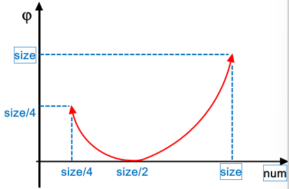

## 回溯法

导学：树搜索 | 最优树搜索策略 | 员工任务分配问题 | 01背包问题

### 7.1 树搜索策略

问题的解可以表示成树的节点或者路径，求解这些问题就变成了树搜索问题；

**布尔表达式可满足性问题 **：（1）输入：n个布尔变量的k个析取式；（2）输出：是否存在这n个布尔变量的一种赋值，使得所有k个析取式都为真；

可以将解表示成树，由**根到叶的一条路径**即为一个解；

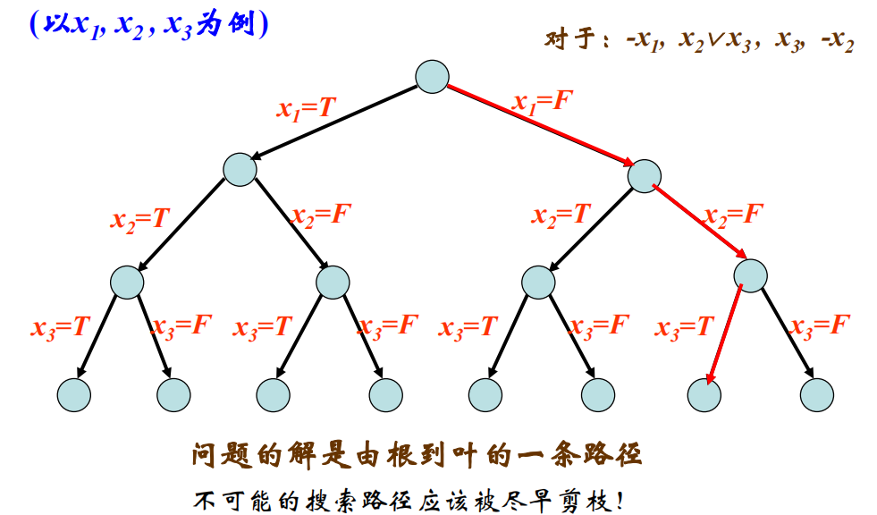

**8-puzzle问题**：（1）输入：8个具有编号，余下一个为空的九宫格；（2）输出：**移动序列**，这个序列可以使得九宫格变成一个规定的状态（1-8顺时针排列）；

解：树上的一个**节点**；

### 7.2 最优树搜索策略

爬山法  | best-first 法|分支界限法

局部优化 | 全局优化 | 优化问题

**爬山法 = 深度优先 + 贪心（启发式测度）**；

​	8-puzzle：f(n)=w(n)，错误位置的方块数；

​	

```
构造由根组成的单元素栈S;
If Top(S)是目标节点 Then 停止;
Pop(S);
S的子节点按照其启发测度由大到小的顺序压入S; 
If S空 Then 失败 Else goto 2.
```


**最少代价优先=dfs + bfs + heap**

根据一个评价函数，在一个优先队列当中维护已经考察过的节点中的最小代价节点，从这个节点开始扩展；

```
使用评价函数构造一个堆H, 首先构造由根组成的单元素堆;
If H的根r是目标节点 Then 停止;
从H中删除r, 把r的子节点插入H; 
If H空 Then 失败 Else goto 2.
```


**分支界限**：迅速找到一个可行解，用其作为界限来进行剪枝；

例：多阶段图搜索问题：最短路径；评价函数：路径和；

> 产生分支的机制：爬山法 | best-first
>
> 产生界限
>
> 剪去不可能产生优化解的分支

### 7.3 personnel assignment problem

​	输入：人的有序集合$P=\{P_1,P_2,...,P_n\},P_1<P_2<...<P_3$；工作的集合$J=\{J_1,J_2,...,J_n\}$，工作是偏序集合；代价矩阵$[C_{ij}]$，$(P_i,J_j)$的代价；

​	输出：矩阵$[X_{ij}]$，为一时，表示存在对应的分配，要使得$\sum_{i,j}C_{ij}X_{ij}$最小；

​		人与工作一一对应；$f(P_i) \le f(P_j),则p_i<p_j;i \ne j, f(P_i)\ne f(P_j)$

​	输出的可行解一定是**J的拓扑序**；

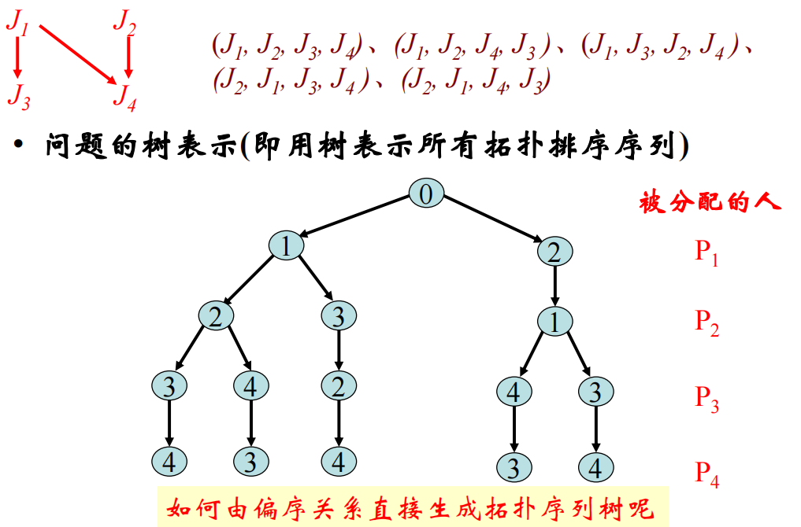

优化剪枝：

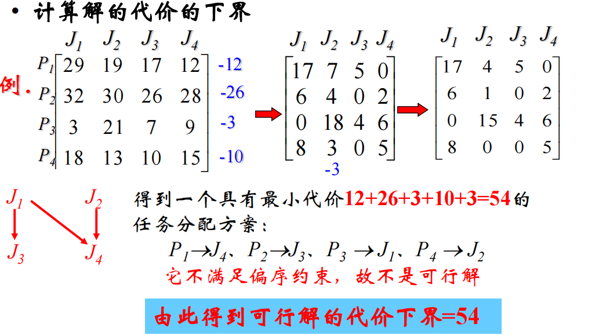

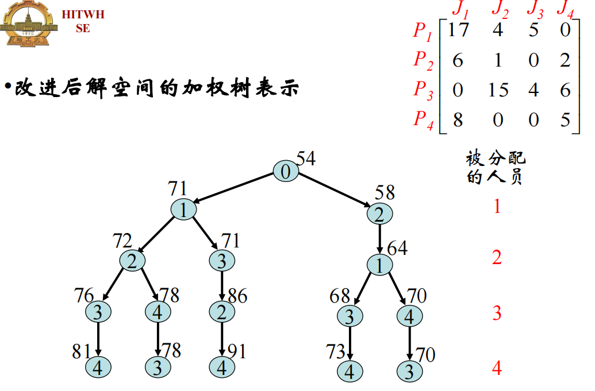

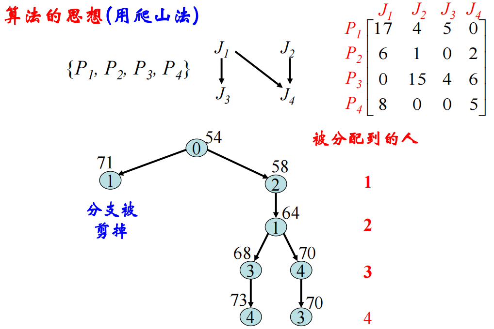

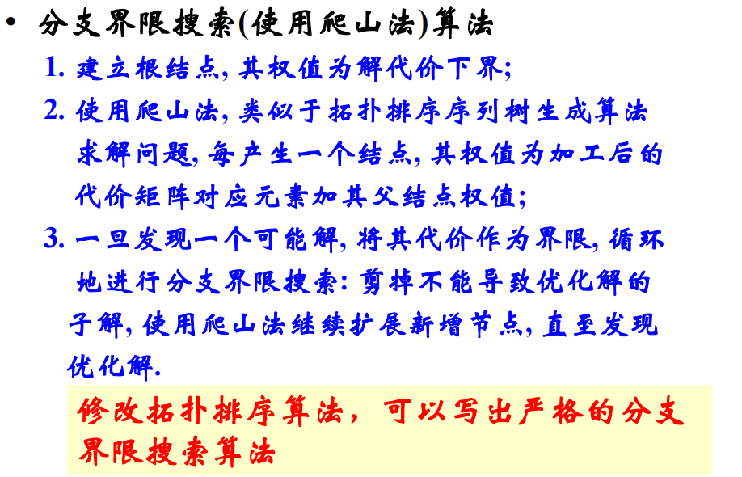

### 7.4 0/1 Knapsack

按照价值重量比降序排列n个物品

空包为根；

用爬山法 | best-first递归划分空间，得到二叉树：每个节点都代表了n个物品中的子集{前i个物品中的一个特定选择，选择**由路径决定**}；每个节点记录：**当前的价值与重量** | **物品价值的上界UB**（用次高的物品填满剩余的背包的价值 | 部分背包问题的解）；

部分背包问题的解是01背包问题的上界，反过来，0/1背包问题的解是部分背包问题的可行解；

## 图算法_不考。。


