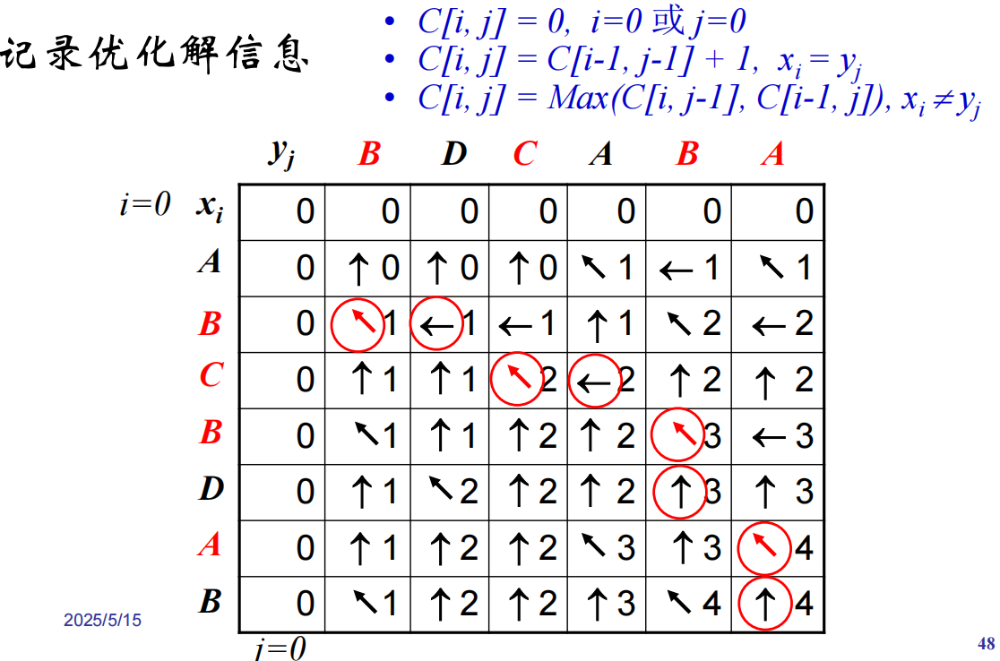
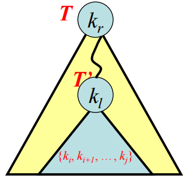
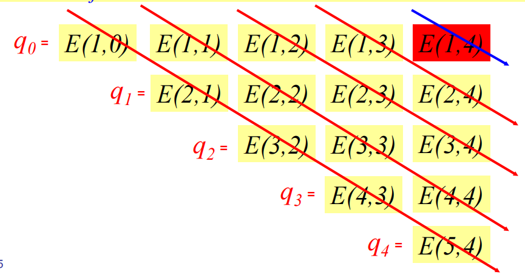

# 算法与数据结构——王金宝

数据结构：存储和组织数据，便于访问和修改；使用过一些算法，但更加侧重数据结构本身的应用，并非针对算法本身

算法：是一种重要的技术，技术自成体系，在效率方面的影响巨大

[TOC]

## 1. 绪论

知道几个人：；**Edsger W. Dijkstra**；**Donald Ervin Knuth**（《The Art of Computer Programming》）；**Stephen Arthur Cook**；**Richard M. Karp**；**Niklaus Wirth**；**John Hopcroft**；**Robert E. Tarjan** ... ...

### 1.1 解决一个计算问题的过程：

> 可计算否：可计算理论 
>
> 能行可计算否：计算复杂性理论
>
> 设计与分析算法：算法设计与分析
>
> 用计算机语言设计实现算法：数据结构与程序设计
>
> 软件系统：编译，操作系统...

#### 1.1.1 可计算理论

> 1. **计算模型**
>
> ​	Turing机、递归函数、lambda演算、正则算法、POST系统
>
> 2. 可计算问题/不可计算问题
>
> 3. **计算模型的等价性--图灵/Church命题**
>
> ​	所有合理的计算模型，其计算能力是等价的


#### 1.1.2 计算复杂性理论

> – **在给定的计算模型下研究问题的复杂性**
>
> • 固有复杂性
>
> • 复杂性上、下界
>
> • 平均复杂性
>
> • 复杂性问题的分类: P=NP?

#### 1.1.3 算法设计和分析

> – 解决可计算问题的算法的设计与分析
>
> – 设计算法的理论、方法和技术
>
> – 分析算法的理论、方法和技术

#### 1.1.4 计算机软件

> – 系统软件
>
> – 工具软件
>
> – 应用软件

### 1.2 算法的概念

——算法的定义、问题的定义、算法的示例

**定义1 (计算)** 可由一个**给定计算模型**机械地执行的规则或计算步骤序列称为该计算模型的一个计算.

> **注意**
>
> • 一个计算机程序是一个计算（计算模型是计算机）
>
> • 计算可能永远不停止——不是算法

**定义2(算法) **算法是一个满足下列条件的**计算**：

> **终止性**：**有限步**内必须停止（有穷性）；
>
> **确定性**：每步都是严格定义和确定的动作；
>
> **能行性**：每个动作都能被精确地机械执行；
>
> 输 入：具有满足给定约束条件的输入； 
>
> 输 出：产生满足给定约束条件的结果**.**

**定义**3 (问题) 设𝐼𝑛𝑝𝑢𝑡和𝑂𝑢𝑡𝑝𝑢𝑡是两个集合. 一个问题是一个关系 𝑃 包含于 INPUT * OUTPUT，𝐼𝑛𝑝𝑢𝑡称为问题𝑃的输入集合，𝐼𝑛𝑝𝑢𝑡的每个元素称为𝑃的一个输入，𝑂𝑢𝑡𝑝𝑢𝑡称为问题𝑃的输出或结果集合，𝑂𝑢𝑡𝑝𝑢𝑡的每个元素称为𝑃的一个结果.

> • 问题定义了输入和输出的关系


## 数学基础

### 2.1 计算复杂性函数的阶

### 2.2 和式的计算和估计

### 2.3 递归方程


## 分治算法


## 动态规划

导学：动态规划的元素；矩阵链乘法；最长公共子序列；0/1背包；最优二叉搜索树 ；

### 4.1 动态规划的元素

​	**分治算法(divide and conquer)的问题**：当子问题不是相互独立的，分治算法将重复计算公共子问题，效率很低；

​	**优化问题**：在**解空间**中找到一个**优化解**；

每个可行解都有一个**代价**；优化问题要解决的是：在所有可行解（解空间）中找到**优化解**（代价最大或者最小的可行解，**最优解**）；最优解**不一定唯一**；

> 应用场景：最短路径--迪杰斯特拉，旅行商--FSP，任务调度等；

​	**动态规划**是解决优化问题的一个方法；**多阶段决策**（一个阶段的决策会影响下一个阶段的决策） + **最优性原理**；

​	

​	**思路**：将原始问题划分成一系列子问题，**不同子问题的数目之和只有多项式量级**；自底向上求解每一个子问题，每个子问题只求解一次并记录下来，保证不同的子问题只求解一次；

​	**适用范围**：有限子问题数目 | 子问题重叠性 | 优化子结构

​	**优化子结构**：一个问题的优化解包含了子问题的优化解；

​	**重叠子问题**：很多子问题被多次使用；

​	

**算法设计步骤**：

		1. 分析**优化子结构**；
		1. **递归定义优化解代价**；
		1. **递归划分**子问题，直至不可分，同时可以分析子问题重叠性；
		1. **自底向上**求解子问题（需要时：构造最优解的信息）；
		1. 根据构造最优解的信息构造最优解；

### 4.2 矩阵链乘法

​	**输入**：$<A_1,A_2,...,A_n>, A_i 是p_{i-1} \times p_{i}矩阵$；

​	**输出**：计算$A_1\times A_2\times...\times A_n$的最小代价；

​	**代价**：A是$p \times q$矩阵，B是$q \times r$矩阵，$A \times B$代价是 $O(pqr)$；

设计矩阵链动态规划算法（按照上述算法设计步骤来）：

**优化子结构**：


**优化解代价**：$cost_{i\to j} = min_{k \in Z[i,j-1]} \{cost_{i\to k} + cost_{k+1 \to j} + p_{i}p_{k}p_{j}\}$

**代价方程**：此时，$m[i,j]$为对应从矩阵i计算到矩阵j的代价

​	$m[i,j] = 0,if \quad i=j$

​	$m[i,j] = min_{i \le k<j}\{m[i,k] + m[k+1,j] +p_{i-1}p_{ik}p_{j}\},if \quad i<j$


**伪代码**：$O(n^3)$

```
Matrix-Chain-Order(p)
n=length(p)-1；
FOR i=1 TO n DO
 	m[i, i]=0;
FOR l=2 TO n DO /* 计算对角线 */
	FOR i=1 TO n-l+1 DO
 	j=i+l-1;
	m[i, j]=∞; 
	FOR k <- i To j-1 DO /* 计算m[i,j] */
		q = m[i, k]+m[k+1, j] + pi-1 *  pk * pj
		IF q<m[i, j] THEN m[i,j]=q; s[i,j] = k;
Return m and s.
```

**构造答案**：$O(n)$

```
Print-Optimal-Parens(s, i, j)
 IF j=i
 	THEN Print “A_i”
 ELSE Print “(”
 	Print-Optimal-Parens(s, i, s[i, j])
 	Print-Optimal-Parens(s, s[i, j]+1, j)
 	Print “)”
```

### 4.3 最长公共子序列

**预备知识**：子序列，公共子序列；

​	**子序列**：

​	$X = <x_1,x_2,...,x_n>$；

​	任意严格递增序列$<i_1,i_2,...,i_k>, 1 \le i_1, i_k \le m,$$ Z = <z_1,z_2,...,z_k> = <x_{i_1},x_{i_2},...x_{i_k}>$是X的子序列

​	**公共子序列**：Z是序列X,Y的公共子序列，当且仅当Z是X的子序列，也是Y的子序列；


**最长公共子序列（LCS）问题**:

​	输入：$X=(x_1,x_2,...,x_m)$, $Y=(y_1,y_2,...,y_n)$；

​	输出：X Y 的公共子序列 $Z = (z_1,z_2,...,z_k)$；

​	第i前缀：$X_i = (x_1,x_2,...x_i)$；

​	**优化子结构**：当X,Y的LCS为$LCS_{XY} = (z_1,z_2,...,z_k)$

​		if $x_m = y_n$，则$LCS_{XY} = LCS_{X_{n-1}Y_{n-1}} + <x_m = y_n>$；

​		if $x_m \neq y_n$，且$z_k \neq x_m$，则 $LCS_{XY}=LCS_{X_{m-1}Y}$；

​		if $x_m \neq y_n$，且$z_k \neq y_n$，则 $LCS_{XY}=LCS_{XY_{n-1}}$；

​	**递归方程**：$C[i,j]$是$X_i,Y_j$的最长公共子序列；

​		$C[i,j] = 0,if \quad i=0 \,  || \, j=0$;

​		$C[i,j] = C[i-1,j-1] + <x_i = y_j> , if \quad x_i = y_j \,\,\, \&\& \,\,\,i ，j > 0$;

​		$C[i,j] = max(C[i-1,j],C[i,j-1]),if \quad x_i \ne y_j \,\, \&\& \,\, i,j>0 $;

​	**计算长度及构造最优解的数据结构**：

​		$C[0:m,0:n] : C[i,j]$是$X_i,Y_j$的LCS；

​		$B[1:m,1:n]:B[i,j]$记录优化解的信息；

​	

**伪代码**：$O(mn)$

```
LCS-length(X, Y)
m=length(X)；n=length(Y)；
For i=0 To m Do 
	C[i,0]=0;
For j=1 To n Do 
	C[0,j]=0;
For i=1 To m Do
	For j=1 To n Do
		If x[i]= y[j] Then
			C[i,j] = C[i-1,j-1]+1；
			B[i,j]=“0”; // 0表示指向 [i-1,j-1]
		Else If C[i-1,j] >= C[i,j-1]
		Then C[i,j] = C[i-1,j];
			B[i,j]=“1”; // 1 表示指向 [i-1,j]
		Else C[i,j]=C[i,j-1]; 
			B[i,j]=“2”;// 2 表示指向 [i,j-1]
Return C and B.
```

**构造最优解**：$O(m + n)$

```
Print-LCS(B, X, i, j)
If i=0 or j=0 Then Return;
If B[i, j]=0 
Then Print-LCS(B, X, i-1, j-1); Print xi;
Else 
	If B[i, j]=“1”
	Then Print-LCS(B, X, i-1, j);
 	Else Print-LCS(B, X, i, j-1).
```

### 0/1背包问题 knapsack

**问题定义**：给定n种物品一个背包，物品i的重量是$w_i$，价值$v_i$，背包承重$C$，问：如何选择装入背包的物品，使装入背包中的物品的总价值最大；每个数值均为**整数**；

注意：每种物品只能选择完全装入或不装入，一个物品之多装入一次；

​	**输入**：$C>0,w_i>0,v_i>0,1 \le i \le n$

​	**输出**：$(x_1,x_2,...,x_n),x_i \in \{0,1\}$，满足$\sum_{1 \le i \le n}w_ix_i \le C$， $\sum_{1 \le i \le n}v_ix_i$最大；

​	**问题Pi划分**：$P_i: {i, i+1,...,n},C- \sum_{1 \le k \le i-1}w_kx_k$，$max\sum_{i \le k \le n}v_kx_k$，其中：重量要求$\sum_{i \le k \le k}w_kx_k \le C - \sum_{1 \le k \le i-1}w_kx_k$，$x_k \in \{0,1\}$；

​	**优化子结构**：当$S_i=(y_i,y_{i+1},...,y_n)$是0/1背包子问题$P_i=[{i,i+1,...,n}，C_i = C -\sum_{1 \le k \le k-1}w_ky_k]$的优化解，那么$S_i=(y_{i +1},y_{i + 2},...,y_i)$是如下子问题$P_{i+1}$的优化解：

​	$max \sum_{i+1 \leq k \leq n} v_k x_k$，$\sum_{i+1 \leq k \leq n} w_k x_k \leq C_i - w_i y_i$，$x_k \in \{0, 1\}, \quad i+1 \leq k \leq n$；

​	**递归方程**：定义代价矩阵m，m[i,j]表示子问题$ [(i, i + 1, ... , n), j] $的优化解的代价，$m(i,j)=\sum_{i\leq k\leq n}\nu_kx_k$；

​	$$\begin{aligned}&m(n,j)=0,\quad0\leq j<w_n\\&m(n,j)=v_n,\quad j\geq w_n\\&m(i,j)=m(i+1,j),0\leq j<w_i\\&m(i,j)=\max\{m(i+1,j),m(i+1,j-w_i)+v_i\},\quad j\geq w_i\end{aligned}$$

​	**递归划分子问题**：


​	**自底向上计算优化解的代价，记录构造优化解的信息**：

伪代码：$O(Cn)$ 背包的大小 * 物品的数量

```
For j=0 To min (w_n-1, C) Do
 	m[n, j] = 0;
For j=w_n To C Do
 	m[n, j] = vn;
For i=n-1 To 2 Do
 	For j=0 To min(wi -1, C) Do
 		m[i, j] = m[i+1, j];
 	For j=wi To C Do
 		m[i, j]=max{m[i+1, j], m[i+1, j-wi]+vi};
If C<w1 Then m[1, C]=m[2, C];
Else m[1, C]=max{m[2, C], m[2, C-w1]+v1};
```

构造优化解：$O(n)$

```
ConstructOptimal(m, i, j)
If m(i,j) = m(i+1,j) ;
Then x_i = 0; construct(m, i+1, j);
Else X_i = 1; construct(m, i+1, j-w_i);

Construct(M)
X=construct(m,1,C);
```

部分背包问题：使用贪心解决即可
	贪心策略：每次放入单位价值最大的物品；

### 4.5 最优二叉搜索树

**预备知识**：二叉搜索树

​	节点集合：$K={k_1,k_2,...k_n}$对应搜索的具体键值；$D={d_0,d_1,...,d_n}$对应搜索的区间，如$d_i = (k_i,k_{i+1}), special: d_0 = (-\infty,k_1),d_n=(k_n,+\infty)$；

​	附加信息：搜索$k_i$的概率为$p_i$,搜索$d_i$的概率为$q_i$，$\sum_{i=1}^np_i+\sum_{j=0}^nq_j=1$

**问题定义**:

​	**输入**：

​		$$\begin{aligned}\text{}&K=\{k_l,k_2,\ldots,k_n\},k_l<k_2<\ldots<k_n,\\&P=\{p_l,p_2,\ldots,p_n\},p_i\text{为搜索}k_i\text{的概率}\\&Q{=}\{q_0,q_l,\ldots,q_n\},q_i\text{为搜索值}d_i\text{的概率}\end{aligned}$$

​	**输出**：构造最小的二叉搜索树T，最小化  $$E(T)=\sum_{i=1}^n(DEP_T(k_i)+1)p_i+\sum_{i=0}^n(DEP_T(d_i)+1)q_i$$

​	**优化解结构**：$K=\{k_1,k_2,\ldots,k_n\}$的优化解的根必为某个$k_r$

​	**优化子结构**：如果优化二叉树包含关键字集合$\{k_i,k_{i+l},\ldots,k_j\}$的子树T'，那么T'就是关于关键字集合$\{k_i,k_{i+l},\ldots,k_j\}$的子问题优化解（这个表示中间还可以有多层，那么T‘是T的左右子树时，自然也成立）；



$E_{T^{\prime}}(T)=\sum_{x=i}^{j}(DEP_{T}(k_{x})+1)p_{x}+\sum_{x=i-1}^{j}(DEP_{T}(d_{x})+1)q_{x}$

​	$=\sum_{x=i}^{j}(DEP_{T^{\prime}}(k_{x})+1)p_{x}+\sum_{x=i-1}^{j}(DEP_{T^{\prime}}(d_{x})+1)q_{x}+(DEP_{T}(k_{l})-DEP_{T^{\prime}}(k_{l}))(\sum_{x=i}^{j}p_{x}+\sum_{x=i-1}^{j}q_{x})$

前两个和式为**子问题的优化解代价方程**，后一个和式为从子问题推导出父问题时的**代价差值**；

​	**递归方程**：

​	$令E(i,j)为\{k_i,...,k_j\}的优化解T_{ij}的期望搜索代价$

​	$\begin{aligned}&\text{当}j{=}i{-}l\text{ 时,}T_{ij}\text{中只有叶结点}d_{i-l},E(i,i{-}l){=}q_{i-l};\end{aligned}$	

​	$E(i,j)=P_r+E(i,r-l)+W(i,r-l)+E(r+l,j)+W(r+l,j)$

​	$E$为代价值；$P_r$为搜索到该子问题$(i,j)$的根节点$r$的概率，$W=(DEP_{T}(k_{l})-DEP_{T^{\prime}}(k_{l}))(\sum_{x=i}^{j}p_{x}+\sum_{x=i-1}^{j}q_{x})$ 为从子问题推到父问题的代价差值（子树增加在父问题里面的深度，这里为1）；


**递归方程化简**：$E(i,j)=min_{i \le r \le j}(E(i,r-1)+E(r+1,j)+W(i,j))$；

**边界条件**：当$i > j，即j = i-1,E(i,j) = q_j$；



**数据结构**：$E[1:n+1]$：存储优化解搜索代价；

​		$W[1:n+1,0:n]$:存储优化解代价增量；

​		$Root[1:n;1:n]$:Root(i,j)记录子问题{i,...,j}的优化解的根;

**伪代码**：time:$O(n^3)$, space:$O(n^2)$

```
Optimal-BST(p, q, n)
For i=1 To n+1 Do
	E(i, i-1) = qi-1; 
	W(i, i-1) = qi-1;
For l=1 To n Do
	For i=1 To n-l+1 Do
 		j=i+l-1; 
 		E(i, j)=inf;
 		W(i, j)=W(i, j-1)+pj+qj;
 		For r=i To j Do
 			t=E(i, r-1)+E(r+1, j)+W(i, j);
 			If t<E(i, j)
 			Then E(i, j)=t; Root(i, j)=r;
Return E and Root
```

**构造优化解**：

```
Extend(Root, n)
(i, j) ← n.range;
If i > j
	n.label ← 𝑑𝑗;
Return;
n.Label ← 𝑘_𝑅𝑜𝑜𝑡[𝑖,𝑗];
L ← Root[i, j];
Initiate node lc;
lc.range ← (i, L-1);
n.leftChild ← lc;
Initiate node rc;
rc.range ← (L+1, j);
n.rightChild ← rc;
Extend(Root, lc);
Extend(Root, rc);
```

总结：

1. 原始问题可以划分成一系列子问题，子问题之间不是相互独立的
2. 不同子问题的数目常常只有多项式量级
3. 解决过程
   1. 优化子结构
   2. 优化解的结构分析
   3. 建立优化解代价的递归方程
   4. 递归地划分子问题
   5. 自底向上计算优化解的代价，记录优化解的构造信息
   6. 构造优化解


## 贪心算法

### 5.1 贪心算法的基本原则

**Greedy的基本概念**

​	贪心算法总是作出在当前看来最好的选择：贪心算法并不从整体最优考虑，它所

作出的选择只是在某种意义上的局部最优选择；

**用途**：求解最优化问题

**基本思想**：算法包含一些列步骤，每一步都有一组选择，决策时选择当前最好的选择；希望通过局部优化选择达到全局优化选择；

​	不一定能得到全局最优解可能存在，可能存在多种贪心策略；、

应用：硬币选择问题——贪心策略：选择当前面值最大的硬币——策略错误；

应用2：区间调度问题（活动选择）

​	**输入：**n各活动区间的集合{[*s1* , *f1* ],[*s2* , *f2* ],…[*s_n* , *f_n* ]}，*s*_i是区间*i*的起始时间，f_i是终止时间；

​	**输出：**具有最多相容区间的调度；

​	**贪心策略：**选择具有最早结束时间的活动；

**Greedy算法产生优化解的条件**：

 1. 优化子结构：一个优化问题的优化解包含它的（剩余）子问题的优化解；

 2. Greedy选择性(greedy_choice property)：一个优化问题的全局优化解可以通过局部优化选择得到；

    换言之：任一实例都存在**至少一个优化解**包含 在这个实例上使用贪心算法 做出的**第一个选择**；

**贪心算法正确性证明**：

​	**交换论证法**：保证最优性不变，从一个最优解逐步替换，最终得到贪心算法的解；

​	1. 贪心算法一定能够找到一个与其他优化解一样优化的解；

​	2. 贪心选择性 做出的选择至少包含在一个优化解中，证明**贪心选择性**和**优化子结构** + **隐含的归纳法**；

​	**归纳法**：对算法步数归纳 | 对问题规模归纳；

​	证明在每一步都比其他算法做的好，或者做的同样好；


**Greedy 与动态规划方法的比较**

​	动态规划：优化子结构 + 子问题重叠性；

​	贪心算法：优化子结构 + greedy选择性；

​	都有对应的适用范围，如0-1背包问题，部分背包问题；


**Greedy的设计步骤**

 	1. 设计贪心选择方法：贪心策略 + 剩余子问题；
 	2. 证明：对于1中的贪心选择来说，所求解的问题具有**优化子结构**；
 	3. 证明：对于1中贪心选择来说，求解的问题具有**greedy选择性**；
 	4. 按照1中策略设计算法；

### 5.2 活动选择问题

​	**输入：**n各活动区间的集合{[*s1* , *f1* ],[*s2* , *f2* ],…[*s_n* , *f_n* ]}，*s*_i是区间*i*的起始时间，f_i是终止时间；

​	**输出：**具有最多相容区间的调度（i, j相容：s_i >= f_j || s_j >= f_i ）；

​	**贪心策略**：每次选择f_i最小的活动；

​	**剩余子问题**：S_i = {j 属于 S | s_j >= f_i}

​	引理1：构造贪心选择性；

​	引理2：构造优化子结构 

​	**证明**: 当A时优化子结构时，对应A' 是 S' = {i | s_i >= f_1}的优化解； 反证：当不是优化解时，存在B'是优化解，那么可以有 |B| = 1 + |B'| > |A|，不成立；

​	引理3：归纳证明；//**之后不再需要**，是对基数的归纳


​	

### 5.3 Huffman编码

​	预备知识：二进制字符编码；定长编码；变长编码；前缀编码；

​	recall: 前缀编码的字典树当中，不存在一个字符位于从根结点到另一个字符的路径上；


​	**编码树的代价**： ${B(T)} = \sum_{c \in \mathcal{C}} f(c) \, d_T(c)$

​	理解：两种理解思路

> 1. 当构造Huffman树时，算法每进行一步，对应两个子树的**深度增加一层**，**总代价增加两个子树包括的有叶节点频率的和**；
> 2. 总代价相当于所有内节点的代价之和，内节点的代价对应两棵子树的代价，也代表着内节点这颗树在增加该根节点（此内节点）时增加的代价；

​	优化编码树问题：

​	**输入**：字母表 $C = {c_1, c_2, ..., c_n}$，频数表 $F = {f(c_1),f(c_2),...,f(c_n)}$

​	**输出**：具有最小 $B(T)$ 的 C 的前缀编码树；

​	**贪心策略**：选择具有最低频数的两个节点 x, y，生成一棵子树 z，直至形成树；

​	**剩余子问题**：

​	$C' = C - \{x, y\} \cup \{z\}$

​	$F' = F - \{f(x),f(y)\} \cup f(z), f(z) = f(x) + f(y)$


### 5.4 最小生成树问题

导览：kruskal, prim算法

预备知识：生成树：边加权无向连通图G的生成树是无向树，整棵树的权值是生成树边权值之和；最小生成树：权值最小的生成树；

**问题定义**：

​	输入：无向连通图$G=(V,E)$,权函数$W$；

​	输出：$G$的最小生成树；

**Kruskal算法**

​	初始化：A为选定的边集，为空；$G_A=(V,A)$为对应的森林；

​	**贪心策略**：选择连接$G_A$两棵树中具有最小权值的边加入A.

​	**贪心选择性**：假如(u,v)是G中权值最小的边，则比有一颗最小生成树包含(u,v)

​		假设T是G的最小生成树，如果$(u,v) \in T$，结论成立；否则，可以添加(u,v)，必会产生包含$(u,v)$的环，然后删除环中不同于$(u,v)$的权值最小的边$(x,y)$，得到$T'$，则$w(T')= w(T) - w(x,y) + w(u,v) \le w(T)$，$T'$也是一颗最小生成树，并且包含(u,v)；

​	**剩余子问题**：假如选择的边是(x,y)间的最小边，那么剩余子问题为 $G(x,y)$；**收缩**$G/(x,y)$：用$z$代替$(x,y)$，将所有与$x,y$相邻的边连至$z$，删除$(x,y)$内部的边，其余不变。**扩张**为收缩的逆操作，记作$G|_z^{(x,y)}$.

​	**最优子结构**：假如$T$是$G$的优化解，并且$(u,v)$是最小边权。那么$T/(u,v)$是$G/(u,v)$的优化解；

​	$T/(u,v)$是$G/(u,v)$的无环连通完全图，因而是子问题的生成树；接下来证明是权值最小的连通树：若不是最小的连通树，那么存在更小的连通树$T'$，边权$W(T') < W(T/(u,v))$，则$T'' = T'|_{z}^{(u,v)}$是G的生成树，且权值更小，与T是G的最小生成树矛盾；

伪代码：$O(ElogE) + O(\alpha(n)(V+2*E)) = O(ElogE)$

```
MST-Kruskal(G(V, E), W)
	A={};
	For any v in V Do
	Make-Set(v); /* 建立只有v的集合 */
	按照W值的递增顺序排序E中的边;
	For (u, v) in E (按W值的递增顺序) Do
	If Find-Set(u) != Find-Set(v) (判断是否出现回路)
	Then A=A + {(u, v)}; Union(u, v); (合并u,v集合)
	Return A
```


**Prim算法**

​	**初始化**：选择任意节点$v_r$作为root，初始化$C=\{v_r\}$；

​	**贪心策略**：选择$C$和$V-C$之前权值最小的边$(x,y)$，其中$x \in C, y \in V-C$，然后更新$C=C \cup \{y\}$

​	**贪心选择性**：$(u,v)$是节点中与$u$关联的权值最小的边，那么必有一颗最小生成树包含边$(u,v)$

​	假设$T$是$G$的一颗最小生成树，假如$(u,v) \in T$，那么结论成立；否则，在$T$中添加$(u,v)$，则会产生环，删除环中与$u$相关联的另一条边，得到$T'$，$w(T') = w(T) - w(u,w) + w(u,w) \le w(T)$，$T'$也是一颗最小生成树，并且包含(u,v)

​	**优化子结构**：T是G的包含（u,v）的最小生成树，那么T/(u,v)是G/(u,v)的最小生成树；

伪代码：$O(ElogV)$

```
MST-Prim(G, W, r)
Input 连通图G，权值函数W，树根r
Output G的一棵以r为根的生成树

1. 	For any v in V[G] Do
2. 		key[v]=INF //C中所有顶点与v邻接的边的最小权值
3. 		pre[v] =null //与v邻接的具有最小权值的边
4. 	key[r] = 0
5. 	Q = V[G] //Q是一个最小堆
6. 	While Q != null do
7. 		u = Extract_Min(Q) 
8. 		for any v in Adj[u] do //至多遍历所有的边，O(E)
9. 			if v in Q 且 w(u,v)<key[v] then
10. 			pre[v]  = u
11. 			key[v]  = w(u,v) //更新信息，就要维护最小堆 O(logV)
12. Return A={(v, pre[v])| v in V[G] -r}
```


## 平摊分析

## 搜索策略

## 图算法

## NP完全性和近似算法

